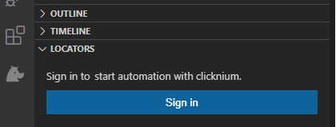

<!--
 Licensed to the Apache Software Foundation (ASF) under one
 or more contributor license agreements.  See the NOTICE file
 distributed with this work for additional information
 regarding copyright ownership.  The ASF licenses this file
 to you under the Apache License, Version 2.0 (the
 "License"); you may not use this file except in compliance
 with the License.  You may obtain a copy of the License at

   http://www.apache.org/licenses/LICENSE-2.0

 Unless required by applicable law or agreed to in writing,
 software distributed under the License is distributed on an
 "AS IS" BASIS, WITHOUT WARRANTIES OR CONDITIONS OF ANY
 KIND, either express or implied.  See the License for the
 specific language governing permissions and limitations
 under the License.
-->

[](https://badge.fury.io/py/Clicknium)
[](https://github.com/clicknium/clicknium-docs/issues)

[](https://clicknium.slack.com/join/shared_invite/zt-1cfxsstw7-s0CeJdhyg5wQ1h7_KKc6QQ#/shared-invite/email)

# clicknium-docs

[Clicknium](https://www.clicknium.com) is a new generation GUI automation framework for all types of applications. It provides easy and smooth developer experience with high-level API for automating GUI application and intelligent plug-ins. It provides you a new way to build your automation world. It also supports for web scraping bots, browser automation, testing for web and desktop applications.

## Requirements
|                     | Main version                 | 
|---------------------|------------------------------|
| Python              | 3.7, 3.8, 3.9, 3.10          | 
| OS                  | Windows 7 SP1 or above       |

### Code Editor
- Visual Studio Code

## Getting started

Get a sample script showing automation of web page and notepad.

## Installation​

### Install Clicknium Python package
```
# Python version is 3.8 or below
pip install clicknium

# Python version is 3.9 or above
pip install --pre pythonnet
pip install clicknium
```

### Setup Clicknium VS Code Extension
install [VS Code Extension](https://marketplace.visualstudio.com/items?itemName=ClickCorp.clicknium) and sign in your Clicknium account. 

  


### Install and enable browser extension
- Click `CLICKNIUM EXPLORER` in Visual Studio Code Activity Bar.  
- Show `AUTOMATION EXTENSIONS` view in Visual Studio Code Side Bar.  
- Choose the Edge browser and click the `Install` button.  
- Open Edge browser, type `edge://extensions/` into address bar and enable `Clicknium Recorder` extension as below.  

  


### Setup sample project
- In Visual Studio Code, open the Command Palette: `Ctrl+Shift+P`
- Input: `Clicknium: Sample`
- Choose a path to locate sample project

The sample.py contains two automation samples, one is Edge web automation, and the other is notepad automation.

```python
import subprocess
from time import sleep
from clicknium import clicknium as cc, locator, ui

def main():
    # sample code to demo web automation and desktop application
    tab = cc.edge.open("https://www.bing.com/")
    tab.find_element(
        locator.new_store.sample.bing.search_sb_form_q).set_text('clicknium')
    tab.find_element(locator.new_store.sample.bing.svg).click()
    sleep(3)
    tab.close()

    process = subprocess.Popen("notepad")
    ui(locator.new_store.sample.notepad.document_15).set_text("clicknium")
    sleep(3)

if __name__ == "__main__":
    main()
```

### Run the sample
In Visual Studio Code, open sample.py and press `Ctrl+F5` to run the script. It will do: 
- Open a search engine page
- Input a keyword and click search button
- Open a notepad
- Input text to notepad

## Contact
Welcome to create a [Github Issue](https://github.com/clicknium/clicknium-docs/issues) or join [Clicknium Slack](https://clicknium.slack.com/) if you have any question. 