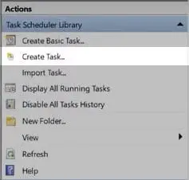

# Frequently Asked Questions

## How to launch a Windows applications

To launch desktop applications, use Python's subprocess module 
```python
import subprocess

process_notpad = subprocess.Popen("notepad")
process_feishu = subprocess.Popen("C:\Users\kay\AppData\Local\sc\scp.exe")  
```

## Why did the locator fail after a while
There are many reasons why a locator may fail, such as dynamic loading, version updates, and context changes. First, you can use the `Recapture&Compare` function on the locator page to re-record and compare the differences between the old and new locators. Different properties will be highlighted.


To make the locator more stable, it is recommended to use wildcards, regular expressions, parameterized locator, and other features to improve the locator's robustness.

## Login Failure

When you try to login and got error: `Uncaught SecurityError: Failed to read the 'localStorage' property from 'Window': Access is denied for this document.` This exception is thrown when the "Block third-party cookies and site data" checkbox is set in Content Settings.  
To find the setting, open Chrome settings, click `Privacy and security` in navigation bar, click `Cookies and other site data`, and view the third item under General settings.
  
If this setting is checked, third-party scripts cookies are disallowed and access to localStorage may result in thrown SecurityError exceptions.

## How to get Clicknium log after the script crash
The default log path is `C:\Users\{currentUser}\AppData\Local\Clicknium\Log`. If you can't find a way to fix your script, you can send zip the log and send it to 'Clicknium@clicknium.com' with some info about your environment, such as OS version, Python version, etc. 

## Can not automate browser running instances with different user profiles

If you encountered the subsequent issue when recording:


This is due to the possibility that you have started several Chrome browser windows using different user profiles. Every Chrome browser window's user profile is visible in the top-right corner.


You can fix this issue by first stopping Clicknium Recorder, closing all open browser tabs, opening the browser solely in a single user profile, and then starting a new recording.

## This element is not similar to previous elements. Please capture it again

If you encountered the subsequent issue when recording similar elements, 


The new recorded locator being different from the old one should be the primary factor. For example:

- They are elements of various types, for example: one with tag "a" and the other with tag "div".
- They are under different iframes.

For more information, please refer to [Capture similar elements](tutorial/recorder/capture_similar_elements.md)

## Browser extension for Chrome is not turned on, do you want to turn it on now?

If you encountered the subsequent issue when recording elements on one browser page,


The main reason should be Clicknium browser extension is not enabled, you can click 'Yes', browser extension page will be opened, you can enable it: 


And refresh the web page or re-open the browser window, and record once more.

## ModuleNotFoundError: No module named 'tkinter'

The following error message may appear when you're running or packaging project.


Get the Python version that the project needs by opening the clicknium.yaml file in the project folder.


First, Check whether the correct version of Python is already installed on your computer.


If it's already installed, use "Python -m tkinter" to verify whether tkinter existing.


Otherwise, reinstall Python and check the "tcl/tk and IDLE" box.


If Python is not installed, download and install the appropriate version.

Open folder "%LOCALAPPDATA%\Clicknium\Envs" and then locate the project name that corresponds to the Python virtual environment folder.


In the "pyvenv.cfg" file, change "home" to the Python installation path


The project will function normally,  you can run it again in Visual Studio Code and package it.

## Why does mouse click, and type text has no effect

Toggles between the system call method and the simulated mouse method. Sometimes, when recording a button, it may record the logo inside the button or the outer border. For system calls, only the button has the click property. Some input boxes also have a click or focus state to be activated, so you can choose to click or focus parameters before input. Since there is no return value after the system call is triggered, Clicknium cannot throw an error. In such cases, it is recommended to click the button in a simulated mouse way.  


## How to set a timer to run

a. Search for Task Scheduler in the taskbar

b. Create a Task or Create a basic Task





c. Task Config：

-  Task name
-  Trigger：Select trigger conditions, daily, weekly or monthly, at startup, at login, etc.
-  Action： Select Launcher, Program or Script: Fill in the address of python.exe. Add parameter: the address of the automation script.