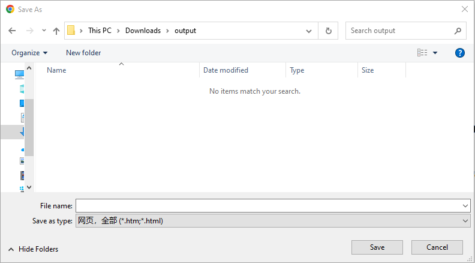
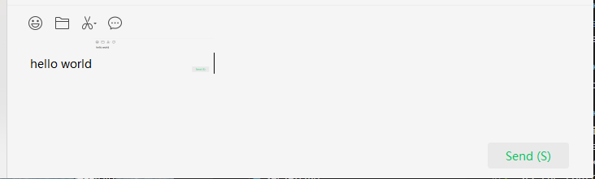

# clear_text
***def clear_text(
        self,
        clear_method: Union[Literal["controlclearvalue", "sendhotkey"], ClearMethod],
        clear_hotkey: Union[Literal["{CTRL}{A}{DELETE}", "{END}{SHIFT}{HOME}{DELETE}", "{HOME}{SHIFT}{END}{DELETE}"], ClearHotKey] = ClearHotKey.CtrlA_Delete,
        preaction: Literal["setfocus", "click"] = PreAction.SetFocus,
        timeout: int = 30
    )***  

Click an element with double click.  

**Parameters:**  
     &emsp;**clear_method**: ClearMethod, the method to clear text for the target element
     `controlclearvalue`: invoke the action on the target element, for web element, perform through javascript; for desktop element, it should support the action, or will be failed.  
     `sendhotkey`:  through send hotkey to clear text on the target element, need specify "clear_hotkey" parameter
    &emsp;**clear_hotkey**: ClearHotKey, default is `{CTRL}{A}{DELETE}`  
        `{CTRL}{A}{DELETE}`: send the combined hotkey "{CTRL}{A}" first, then send hotkey "{DELETE}"  
        `{END}{SHIFT}{HOME}{DELETE}`: send the hotkey "{END}" first, then send combined hotkey "{SHIFT}{HOME}, then send hotkey "{DELETE}"  
        `{HOME}{SHIFT}{END}{DELETE}`: send the hotkey "{HOME}" first, then send combined hotkey "{SHIFT}{END}, then send hotkey "{DELETE}"  
    &emsp;**preaction**: PreAction, before clear text, which action should be taken on the target element   
    &emsp;**timeout**: int  
        &emsp;&emsp; Timeout for locating element. The unit of parameter is seconds. Default is set to 30 seconds.  

**Returns:**  
    &emsp;None

**Example:**
- Desktop file saveas dialog   
  
For the file saveas dialog, filename input box can use clear_text to clear the existing content,
as the control support ValueAction so can use "controlclearvalue" method


```python
    from clicknium import clicknium as cc, locator, ui  
    ui(locator.chrome.edit_1001).clear_text(clear_method="controlclearvalue")
```

- Wechat message input box  
  
the Ui element don't support "controlclearvalue", if need clear text, can use the following way  

```python
    from clicknium import clicknium as cc, locator, ui  
    ui(locator.wechat.edit1).clear_text(clear_method="sendhotkey", clear_hotkey="{CTRL}{A}{DELETE}", preaction="click")

```

- Web input
```python
driver = cc.chrome.open("https://getbootstrap.com/docs/5.1/forms/input-group/")
driver.find_element(locator.chrome.getbootstrap.text).set_text("hello")
driver.find_element(locator.chrome.getbootstrap.text).clear_text(clear_method=ClearMethod.ControlClearValue)

```