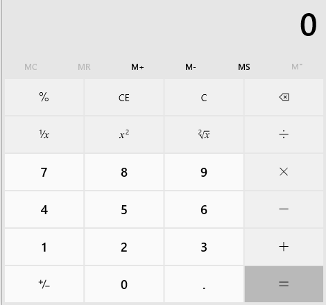

# click <!-- {docsify-ignore-all} -->
***def click(
        self,
        mouse_button: Literal["left", "middle", "right"] = MouseButton.Left,
        click_location: ClickLocation = ClickLocation(),
        click_method: Union[Literal["default", "mouse-emulation", "control-invocation"], ClickMethod] = ClickMethod.Default,
        modifier_key: Literal["none-key", "alt", "ctrl", "shift","win"]  = ModifierKey.NoneKey,
        timeout: int = 30
    ) -> None***  

Single click the target element.

**Parameters:**  
    &emsp;**mouse_button**: MouseButton  
        &emsp;&emsp; The available values are: 'left', 'right' and 'center', default is 'left'.  
    &emsp;**click_location**: ClickLocation  
        &emsp;&emsp; [ClickLocation](./doc/api/python/uielement/clicklocation.md) is set to define the click of the element position.  
    &emsp;**click_method**: ClickMethod  
        &emsp;&emsp; click method is set to choose which method to use when clicking the element. Default vaule is default.  
        &emsp;&emsp; `mouse-emulation`: perform mouse emulator, move the mouse to the target element and click  
        &emsp;&emsp; `control-invocation`: invoke the action on the target element, for web element, perform through javascript; for windows application element, it should support the action, or it will be failed.  
        &emsp;&emsp; `default`: for web element, use `control-invocation`; for desktop element, use `mouse-emulation`  
    &emsp;**modifier_key**: ModifierKey  
        &emsp;&emsp; modifier key is set to click with the modifier key("alt", "ctrl", "shift", "win"). Default vaule is none.      
    &emsp;**timeout**: int  
        &emsp;&emsp; timeout for the operation, the unit is second, and the default value is 30 seconds. 

**Returns:**  
    &emsp;None

**Example:**

- click left button
***
```python
    from clicknium import clicknium as cc, locator, ui
    ui(locator.chrome.bing.svg).click(mouse_button = "left")
    # same as
    cc.find_element(locator.chrome.bing.svg).click(mouse_button = "left")
    
```

- click with offset  


> Remarks
>- import ClickLocation module with `from clicknium.common.models.clicklocation import ClickLocation`

By clicknium recorder, record '5' button as
default if we invoke click on button '5', `ui(locator.applicationframe.button_num5butto).click()`, and it will click on the central position of button '5'.  
We can set the xrate to 1, it will move the point from default(button '5' central position) to right button '6' central position
`ui(locator.applicationframe.button_num5butto).click(click_location=ClickLocation(xrate=1))`
We can set the yrate to 1, it will move the point from default(button '5' central position) to down button '2' central position
`ui(locator.applicationframe.button_num5butto).click(click_location=ClickLocation(yrate=1))`  

- click modifier_key  
For windows file explorer as follows:  
  
if we invoke click on control 'test3 folder' as  
`ui(locator.explorer.edit_system_item).click()`
the select item will be 'test3 folder', and 'test1 folder' will be deselected.  
  
If we want to add 'test3 folder' in selection list, click as follows:
`ui(locator.explorer.edit_system_item).click(modifier_key=ModifierKey.Ctrl)`
 