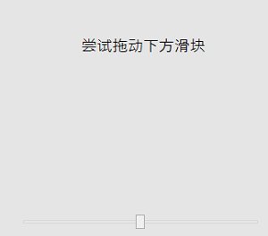
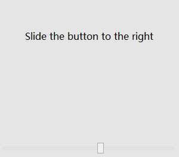

# drag_drop
***def drag_drop(
        self,
        xpoint: int = 0,
        ypoint: int = 0,
        speed: int = 50,
        timeout: int = 30
    )***  

Click an element with double click.  

**Parameters:**  
    &emsp;**xpoint**:  pixels of X-Axis will be move.  
    &emsp;**ypoint**: pixels of X-Axis will be move.  
    &emsp;**speed**: drag speed. The unit of parameter is ms/10px. Default is 50.  
    &emsp;**timeout**: int  
        &emsp;&emsp; Timeout for the operation. The unit of parameter is seconds. Default is set to 30 seconds.  

**Returns:**  
    &emsp;None

**Example:**
***
```python
    from clicknium import clicknium as cc, locator, ui
    # drag the target scroll button right to 20 pixels
    ui(locator.app.bing.scrollbutton).drag_drop(20, 0)
    # same as
    cc.find_element(locator.app.bing.scrollbutton).drag_drop(20, 0)
    
    # drag the target scroll button down to 20 pixels
    ui(locator.app.bing.scrollbutton).drag_drop(0, 20)
```

- move scroll bar of notepad  
  
if you need scroll down 50 pixels, can invoke like this: `ui(locator.notepad.thumb_scrollbart).drag_drop(0, 50)`  
  

- move slipper from left to right  
  
if you need scroll right 20 pixels, can invoke like this: `ui(locator.uiautomationwpfd.thumb_thumb).drag_drop(20, 0)`  
  