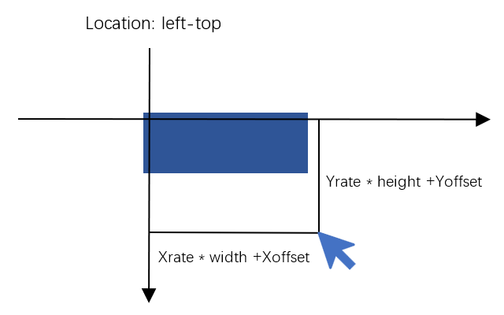

# MouseLocation
**MouseLocation class is to define the position of mouse action on target element. It is being used in [click](./doc/api/python/uielement/click.md), [double_click](./doc/api/python/uielement/double_click.md), [mouse_up](./doc/api/python/uielement/mouse_up.md) and [mouse_down](./doc/api/python/uielement/mouse_down.md).**

**Parameters:**  
    &emsp;**Location**: Location  
        &emsp;&emsp; The relative position to the target element to perform the mouse action. The available values are 'center', 'left-top', 'left-bottom', 'right-top' and 'right-bottom', and the default value is 'center'.  
    &emsp;**Xoffset**: int   
        &emsp;&emsp; sets the x-direction offset relative to Location in pixel. Defautl is 0.  
    &emsp;**Yoffset**: int  
        &emsp;&emsp; sets the y-direction offset relative to Location in pixel. Default is 0.  
    &emsp;**Xrate**: float  
        &emsp;&emsp; sets the x-direction offset relative to Location in percentage of target element width. Default is 0.  
    &emsp;**Yrate**: float  
        &emsp;&emsp; sets the y-direction offset relative to Location in percentage of target element height. Default is 0.

**Remarks**:
> The position calculation can be illustrated as below: 
>
> 
> 
    
**Definition:**
```python
    class MouseLocation(object):

     def __init__(self, location: Literal["center", "left-top", "left-bottom", "right-top","right-bottom"] = Location.Center, xoffset=0, yoffset=0, xrate=0, yrate=0):
        self.Location = location
        self.Xoffset = xoffset
        self.Yoffset = yoffset
        self.Xrate = xrate
        self.Yrate = yrate
     
```