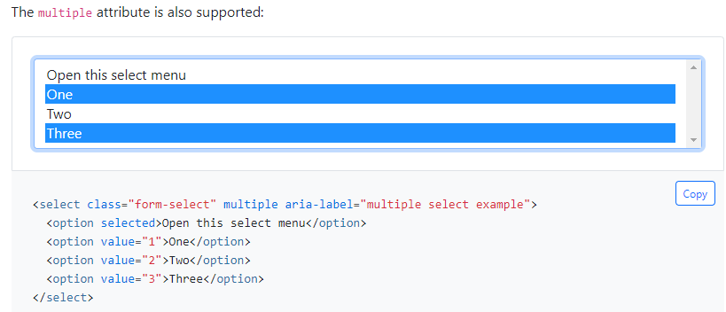

# select_items
***def select_items(
        self,
        items: list,
        clear_selected: bool = True,
        timeout: int = 30
    ) -> None***  

Select multiple options for the target element that can support multiple selections.

**Parameters:**  
    &emsp;**items [Required]**: list  
        &emsp;&emsp; Options to be selected.  
    &emsp;**clear_selected**: bool  
        &emsp;&emsp; Whether to clear existing selections, default is True.    
    &emsp;**timeout**: int  
        &emsp;&emsp; timeout for the operation, the unit is second, and the default value is 30 seconds.   

**Returns:**  
    &emsp;None

**Example:**
***
- Select multiple items on web element
  
```python
from clicknium import clicknium as cc, locator, ui

chrome_tab = cc.chrome.open("https://contoso.com")
chrome_tab.find_element(locator.chrome.page.multiselect).select_item({'One', 'Three'})

# as showing below, 'One' and 'Three' are selected.

```

  