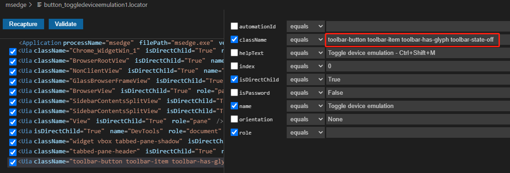
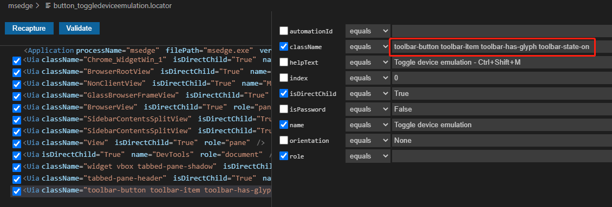
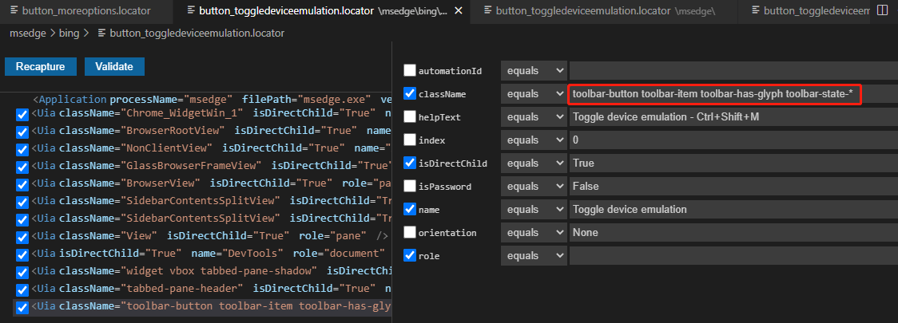

# Locator<!-- {docsify-ignore-all} -->

  - [Overview](#overview)
  - [UIA](#uia)
  - [IA](#ia)
  - [Web Automation](#web-automation)
    - [Tab](#tab)
    - [Web](#web)
  - [Examples](#examples)
    - [wildword locator](#wildword-locator)

## Overview 
UI element locator is a string, XML fragment in the following formats,
<Application .../><Uia .../>/<Uia .../>  
<Application .../><Tab .../>/<Web .../>  
with all information to locate the element.
First node `Application` contains attributes of the target application
<Application processName="notepad" filePath="notepad.exe" version="1.3" />  

| Name      | Description |
| ----------- | ----------- |
| processName      |  name of the target process   |
| filePath      |  the name of process file, can be ignored when locating element  |
| version      |  clicknium locator schema version   |  

The last node contains the attibutes of the target UI element.
The nodes between `Application` and the last node are the parent or ancestor of the target element.

The attributes in locator are used to identify the target element. The operator of attribute value is `equals` by default, and we support the following operators:
`equals`, `contains`, `startWith`, `endWith`.  
The attributes only supporting wildword search, for example `name='test?_node*`. '?' match 1 character, '*' match 0 or more characters can use `contains`, `startWith`, `endWith`.  
As Clicknium supports different automation technologies, shown as diffrent tags and attributes collection in locator schema, here we list the attributes of each tag.  

## UIA
| Name      | equals | contains |startWith |endWith |
| ----------- | ----------- |----------- |----------- |----------- |
| Name |  <font color=Green><B>Yes</B></font>   |<font color=Green><B>Yes</B></font>|<font color=Green><B>Yes</B></font>|<font color=Green><B>Yes</B></font>|
| AutomationId |  <font color=Green><B>Yes</B></font>   |<font color=Green><B>Yes</B></font>|<font color=Green><B>Yes</B></font>|<font color=Green><B>Yes</B></font>|
| ClassName |  <font color=Green><B>Yes</B></font>   |<font color=Green><B>Yes</B></font>|<font color=Green><B>Yes</B></font>|<font color=Green><B>Yes</B></font>|
| HelpText |  <font color=Green><B>Yes</B></font>   |<font color=Green><B>Yes</B></font>|<font color=Green><B>Yes</B></font>|<font color=Green><B>Yes</B></font>|
| Role |  <font color=Green><B>Yes</B></font>   |<font color=Red><B>No</B></font>|<font color=Red><B>No</B></font>|<font color=Red><B>No</B></font>|
| IsDirectChild |  <font color=Green><B>Yes</B></font>   |<font color=Red><B>No</B></font>|<font color=Red><B>No</B></font>|<font color=Red><B>No</B></font>|
| AccessKey |  <font color=Green><B>Yes</B></font>   |<font color=Red><B>No</B></font>|<font color=Red><B>No</B></font>|<font color=Red><B>No</B></font>|
| IsPassword |  <font color=Green><B>Yes</B></font>   |<font color=Red><B>No</B></font>|<font color=Red><B>No</B></font>|<font color=Red><B>No</B></font>|
| AcceleratorKey |  <font color=Green><B>Yes</B></font>   |<font color=Red><B>No</B></font>|<font color=Red><B>No</B></font>|<font color=Red><B>No</B></font>|
| ItemType |  <font color=Green><B>Yes</B></font>   |<font color=Red><B>No</B></font>|<font color=Red><B>No</B></font>|<font color=Red><B>No</B></font>|
| ItemStatus |  <font color=Green><B>Yes</B></font>   |<font color=Red><B>No</B></font>|<font color=Red><B>No</B></font>|<font color=Red><B>No</B></font>|
| Orientation |  <font color=Green><B>Yes</B></font>   |<font color=Red><B>No</B></font>|<font color=Red><B>No</B></font>|<font color=Red><B>No</B></font>|
| Index |  <font color=Green><B>Yes</B></font>   |<font color=Red><B>No</B></font>|<font color=Red><B>No</B></font>|<font color=Red><B>No</B></font>|

## IA
| Name      | equals | contains |startWith |endWith |
| ----------- | ----------- |----------- |----------- |----------- |
| Name |  <font color=Green><B>Yes</B></font>   |<font color=Green><B>Yes</B></font>|<font color=Green><B>Yes</B></font>|<font color=Green><B>Yes</B></font>|
| AutomationId |  <font color=Green><B>Yes</B></font>   |<font color=Green><B>Yes</B></font>|<font color=Green><B>Yes</B></font>|<font color=Green><B>Yes</B></font>|
| ClassName |  <font color=Green><B>Yes</B></font>   |<font color=Green><B>Yes</B></font>|<font color=Green><B>Yes</B></font>|<font color=Green><B>Yes</B></font>|
| HelpText |  <font color=Green><B>Yes</B></font>   |<font color=Green><B>Yes</B></font>|<font color=Green><B>Yes</B></font>|<font color=Green><B>Yes</B></font>|
| AccessKey |  <font color=Green><B>Yes</B></font>   |<font color=Green><B>Yes</B></font>|<font color=Green><B>Yes</B></font>|<font color=Green><B>Yes</B></font>|
| DefaultAction |  <font color=Green><B>Yes</B></font>   |<font color=Green><B>Yes</B></font>|<font color=Green><B>Yes</B></font>|<font color=Green><B>Yes</B></font>|
| Description |  <font color=Green><B>Yes</B></font>   |<font color=Green><B>Yes</B></font>|<font color=Green><B>Yes</B></font>|<font color=Green><B>Yes</B></font>|
| Role |  <font color=Green><B>Yes</B></font>   |<font color=Red><B>No</B></font>|<font color=Red><B>No</B></font>|<font color=Red><B>No</B></font>|
| IsDirectChild |  <font color=Green><B>Yes</B></font>   |<font color=Red><B>No</B></font>|<font color=Red><B>No</B></font>|<font color=Red><B>No</B></font>|
| Tag |  <font color=Green><B>Yes</B></font>   |<font color=Red><B>No</B></font>|<font color=Red><B>No</B></font>|<font color=Red><B>No</B></font>|
| Index |  <font color=Green><B>Yes</B></font>   |<font color=Red><B>No</B></font>|<font color=Red><B>No</B></font>|<font color=Red><B>No</B></font>|

## Web Automation

### Tab
| Name      | equals | contains |startWith |endWith |
| ----------- | ----------- |----------- |----------- |----------- |
| Name |  <font color=Green><B>Yes</B></font>   |<font color=Green><B>Yes</B></font>|<font color=Green><B>Yes</B></font>|<font color=Green><B>Yes</B></font>|
| Title |  <font color=Green><B>Yes</B></font>   |<font color=Green><B>Yes</B></font>|<font color=Green><B>Yes</B></font>|<font color=Green><B>Yes</B></font>|
| URL |  <font color=Green><B>Yes</B></font>   |<font color=Green><B>Yes</B></font>|<font color=Green><B>Yes</B></font>|<font color=Green><B>Yes</B></font>|
| ClassName |  <font color=Green><B>Yes</B></font>   |<font color=Green><B>Yes</B></font>|<font color=Green><B>Yes</B></font>|<font color=Green><B>Yes</B></font>|
| Role |  <font color=Green><B>Yes</B></font>   |<font color=Red><B>No</B></font>|<font color=Red><B>No</B></font>|<font color=Red><B>No</B></font>|
| Index |  <font color=Green><B>Yes</B></font>   |<font color=Red><B>No</B></font>|<font color=Red><B>No</B></font>|<font color=Red><B>No</B></font>|

### Web
| Name      | equals | contains |startWith |endWith |
| ----------- | ----------- |----------- |----------- |----------- |
| Name |  <font color=Green><B>Yes</B></font>   |<font color=Green><B>Yes</B></font>|<font color=Green><B>Yes</B></font>|<font color=Green><B>Yes</B></font>|
| Id |  <font color=Green><B>Yes</B></font>   |<font color=Green><B>Yes</B></font>|<font color=Green><B>Yes</B></font>|<font color=Green><B>Yes</B></font>|
| Type |  <font color=Green><B>Yes</B></font>   |<font color=Green><B>Yes</B></font>|<font color=Green><B>Yes</B></font>|<font color=Green><B>Yes</B></font>|
| AncestorId |  <font color=Green><B>Yes</B></font>   |<font color=Green><B>Yes</B></font>|<font color=Green><B>Yes</B></font>|<font color=Green><B>Yes</B></font>|
| AncestorName |  <font color=Green><B>Yes</B></font>   |<font color=Green><B>Yes</B></font>|<font color=Green><B>Yes</B></font>|<font color=Green><B>Yes</B></font>|
| CssSelector |  <font color=Green><B>Yes</B></font>   |<font color=Green><B>Yes</B></font>|<font color=Green><B>Yes</B></font>|<font color=Green><B>Yes</B></font>|
| XPath |  <font color=Green><B>Yes</B></font>   |<font color=Green><B>Yes</B></font>|<font color=Green><B>Yes</B></font>|<font color=Green><B>Yes</B></font>|
| SInfo |  <font color=Green><B>Yes</B></font>   |<font color=Green><B>Yes</B></font>|<font color=Green><B>Yes</B></font>|<font color=Green><B>Yes</B></font>|
| TabIndex |  <font color=Green><B>Yes</B></font>   |<font color=Green><B>Yes</B></font>|<font color=Green><B>Yes</B></font>|<font color=Green><B>Yes</B></font>|
| Href |  <font color=Green><B>Yes</B></font>   |<font color=Green><B>Yes</B></font>|<font color=Green><B>Yes</B></font>|<font color=Green><B>Yes</B></font>|
| Src |  <font color=Green><B>Yes</B></font>   |<font color=Green><B>Yes</B></font>|<font color=Green><B>Yes</B></font>|<font color=Green><B>Yes</B></font>|
| Title |  <font color=Green><B>Yes</B></font>   |<font color=Green><B>Yes</B></font>|<font color=Green><B>Yes</B></font>|<font color=Green><B>Yes</B></font>|
| Tag |  <font color=Green><B>Yes</B></font>   |<font color=Red><B>No</B></font>|<font color=Red><B>No</B></font>|<font color=Red><B>No</B></font>|
| TableRow |  <font color=Green><B>Yes</B></font>   |<font color=Red><B>No</B></font>|<font color=Red><B>No</B></font>|<font color=Red><B>No</B></font>|
| TableCol |  <font color=Green><B>Yes</B></font>   |<font color=Red><B>No</B></font>|<font color=Red><B>No</B></font>|<font color=Red><B>No</B></font>|
| IsLeaf |  <font color=Green><B>Yes</B></font>   |<font color=Red><B>No</B></font>|<font color=Red><B>No</B></font>|<font color=Red><B>No</B></font>|
| Index |  <font color=Green><B>Yes</B></font>   |<font color=Red><B>No</B></font>|<font color=Red><B>No</B></font>|<font color=Red><B>No</B></font>|


## Examples
### wildword locator
Open Edge browser, press `F12` to show developer tool sidebar, you can see the button 'Toggle device emulation'.
  
If you record the locator of button 'Toggle device emulation', you can see the following locators.

- normal mode  
  
  
- mobile emulation mode  

  

The attribute of classname is dynamic. To stabilize identification of button 'Toggle device emulation', you can leverage wildword locator.  
 

In both modes, the button can be located successfully.
And you can know the current mode through get_property. 
```
from clicknium import clicknium as cc, ui, locator

class_name = ui(locator.msedge.bing.button_toggledeviceemulation).get_property("ClassName")
if class_name.endswith('state-off'):
    print('normal mode')
else:
    print('mobile emulation mode')
```

The following cases can be considered as wildword locator:
- the window title is dynamic, for example the title includes version string, but application version can be upgraded
- the url of the web page is dynamic
- value of the attribute is dynamic