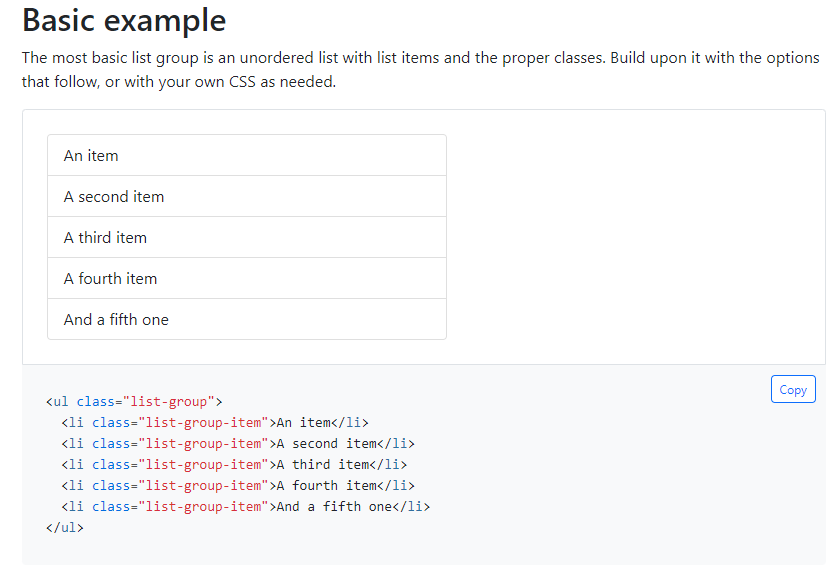
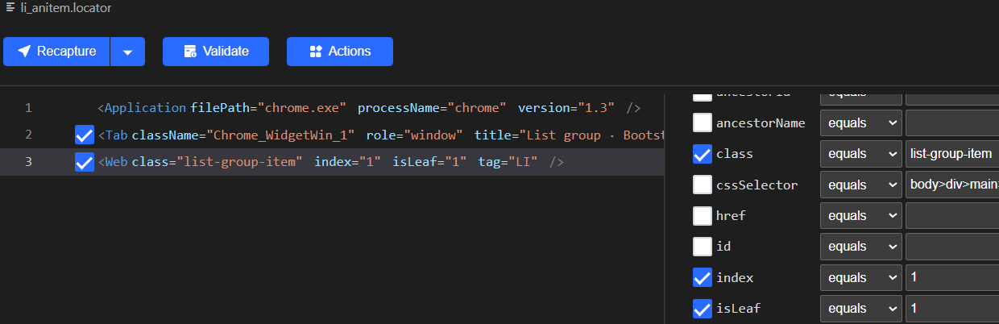
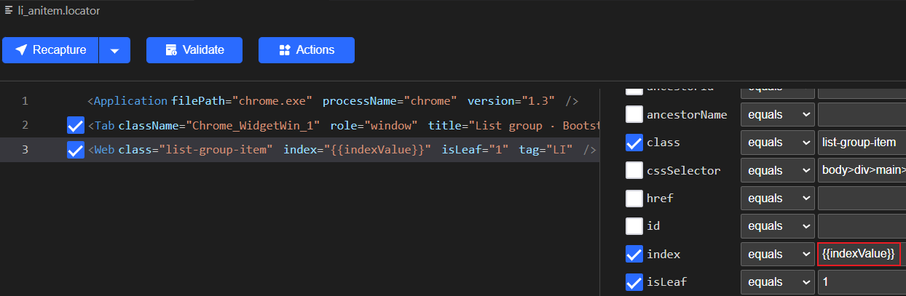
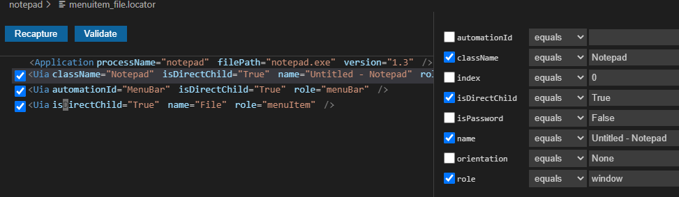

# Parametric Locator<!-- {docsify-ignore-all} -->

  - [Overview](#overview)
  - [Examples](#examples)
    - [Web Example](#web-example)
    - [Windows application Example](#windows-application-example)

## Overview
 Parameters in locator string can be used as value or partial value of the attribute in parametric locator. Users can use the parametric locator in the automation project to replace the ones with the varaibles or data. This allows the locator to match series of elements, instead of single target element..
- dynamic value: {{varaible}}, the variable in locator
  
formats as the following:  
`<Web ancestorId="{{id}}" tag="A" />`
or set partial value as parameter:  
`<Web ancestorId="video-{{id}}" tag="A" />`

- Use parametric locator in project  
```python
from clicknium import clicknium as cc, locator, ui
# replace varaible 'name' in parametric locator during runtime
variables = {"name":"test"}
ui(locator.chrome.bing.search_sb_form_q, variables)
```

## Examples
How to use the parametric locator for web page and windows applciation? Here are two examples.
### Web Example  
  
Locate the item in list, , the locator string is as  following after recording:  
  
Add parametes as following to loop over each item:   
  

```python
from clicknium import clicknium as cc, locator, ui

index = 1
driver = cc.chrome.open("https://getbootstrap.com/docs/5.1/forms/input-group/")
while True:
    variables = {"index":index}
    if driver.is_existing(locator.chrome.getbootstrap.li_anitem, variables):
        text = driver.find_element(locator.chrome.getbootstrap.li_anitem, variables).get_text()
        print(text)
        index += 1
    else:
        break
```

### Windows application Example  
  
Locate the menu item, the locator string is as following after recording:  
  
Add parametes as following to loop over each menu item:
  

```python
from clicknium import clicknium as cc, locator, ui

titles = {'File', 'Edit', 'Format', 'View', 'Help'}

for title in titles:
    variables = {"title":title}
    text = ui(locator.chrome.getbootstrap.li_anitem, variables).get_text()
    print(text)
```