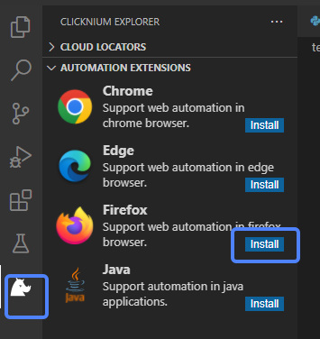

# Firefox Extension

**You can automate Firefox by installing the Firefox extension.**

> **Remarks:**
>
>- The minimum Firefox version is 56.
>- Please close Firefox browser before installing the extension.

## Install

1. You can install the extension in two ways:

    - Install the extension in [VSCode Clicknium Extension](./../../concepts/vscode/vscode.md)  
        
    - Install the extenion via [Clicknium Python command](./../../references/python/webdriver/webextension/webextension.md)  

    ```python
    from clicknium import clicknium as cc

    # install firefox extension
    cc.firefox.extension.install()
    ```

2. Enable extension in Firefox 
    Open firefox browser and in the open page, find the `Clicknium Recorder` extension, and add it.  
    &emsp;&emsp;

3. You can refer to console output for more installation details.