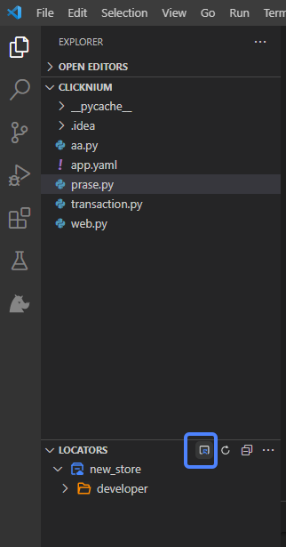
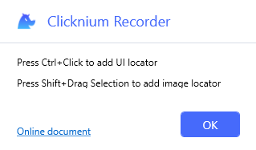
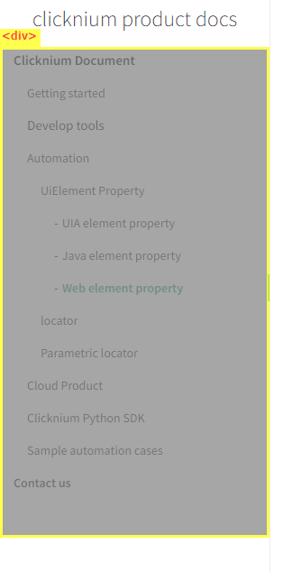
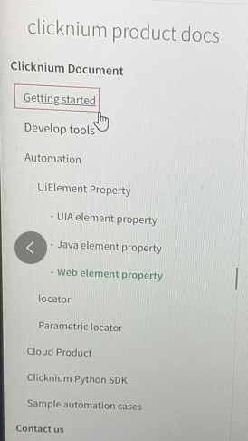

# Image Automation

## Overview
Clicknium automation stask with many functions supports image automation.
Clicknium locator schema is designed for extension in Windows application locator, java application locator and image locator.

## Capture image locator
Open a project in Visual Studio Code by pressing `Ctrl + F10`, or clicking the button `Capture` to invoke Clicknium recorder.  
  

- Hover the mouse over the element to highlight it.  
- Press `Ctrl` and click the element to capture its locator.  
- Press `Shift` and select one area with the mouse to capture the image and it will be stored as image in locator.  

   

For example  
- Choose the target element  

  
- Press `Shift` and drag to select an area  

  

You will get the locator as follows:   
  

Image locator contains two parts.  
The first part is anchor element. In the process of running, firstly find the anchor element, then capture anchor image depending on the image method attributes, and find the target image in anchor image by image matching algorithm.
The second part is image, supporting the following attributes:  

| Name      | Description | equals | contains |startWith |endWith |
| ----------- | ----------- |----------- |----------- |----------- |----------- |
| accuracy | The minimum similarity between the target image and the one in image locator. It is useful when the image to be found is slightly different from the one in the locator. Measurement unit is from 0 to 1 with default value 0.75. |<font color="Green"><B>Yes</B></font>   |<font color="Red"><B>No</B></font>|<font color="Red"><B>No</B></font>|<font color="Red"><B>No</B></font>|
| dpi |  we recommend the DPI settings of Windows OS in the process of running is the same as the ones when recording|<font color="Green"><B>Yes</B></font>   |<font color="Red"><B>No</B></font>|<font color="Red"><B>No</B></font>|<font color="Red"><B>No</B></font>|
| method | enum values define the algorithm of image matching. The value is autoset when recording | <font color="Green"><B>Yes</B></font> |<font color="Red"><B>No</B></font>   |<font color="Red"><B>No</B></font>|<font color="Red"><B>No</B></font>|<font color="Red"><B>No</B></font>|
| filePath | the selection area of image recording, used in the process of image matching |<font color="Green"><B>Yes</B></font>   |<font color="Red"><B>No</B></font>|<font color="Red"><B>No</B></font>|<font color="Red"><B>No</B></font>|
| matchIndex | which will be selected when more than one area is found during image matching, default is 0, it means the first matching area |<font color="Green"><B>Yes</B></font>   |<font color="Red"><B>No</B></font>|<font color="Red"><B>No</B></font>|<font color="Red"><B>No</B></font>|
| elementRect | store the anchor element area during recording. No need to modify the value |<font color="Green"><B>Yes</B></font>   |<font color="Red"><B>No</B></font>|<font color="Red"><B>No</B></font>|<font color="Red"><B>No</B></font>|
| selectionRect | store the selection area during recording. No need to modify the value  |<font color="Green"><B>Yes</B></font>   |<font color="Red"><B>No</B></font>|<font color="Red"><B>No</B></font>|<font color="Red"><B>No</B></font>|
| timeout |Specify the maximum time interval in image matching, default is 5000 milliseconds  |<font color="Green"><B>Yes</B></font>   |<font color="Red"><B>No</B></font>|<font color="Red"><B>No</B></font>|<font color="Red"><B>No</B></font>|

the definition of methods:
- HighestAccuracy: compare the images found in whole Windows screen
- InRegionHighestAccuracy: compare the images found in anchor element area
- OutRegionHighestAccuracy: comapre the images found out of the anchor element area

`method` attributes are automatically set based on the selection area and corresponding anchor area in the process of recording 
if the selection area is inside the anchor element area, set to 'InRegionHighestAccuracy';  
if the selection area intersects with the anchor element area, set to 'HighestAccuracy';
if the selection area is outside the anchor element area, set to 'OutRegionHighestAccuracy';

## Use image locator in project
Image locator can be used in the same way as other locators, for example  
```python
from clicknium import clicknium as cc, locator, ui


#open new browser window
driver = cc.chrome.open("https://www.bing.com")
driver.find_element(locator.chrome.img1).click

ui(locator.notepad.menuitem).click()
```  

The following functions support image locator:
- click
- double_click
- mouse_up
- mouse_down
- drag_drop
- get_position
- get_size
- highlight
- hover
- send_hotkey
- set_text (parameter `by` should be `sendkey-after-click`)

## Example
If the application or the target UI element can not be located by other automation technologies when the area image is stable, users can try image locator.