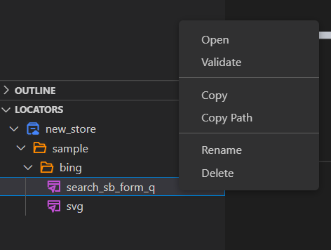
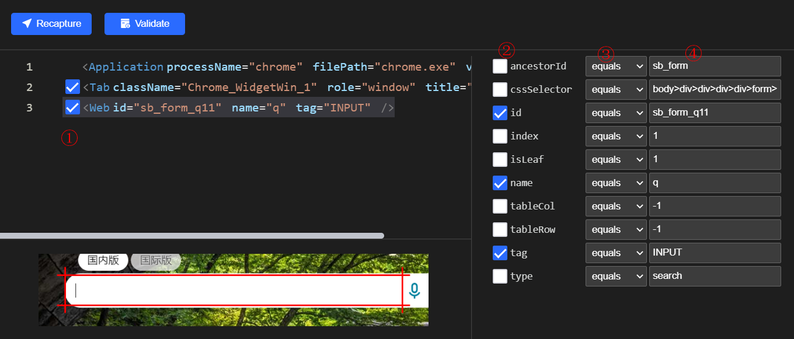
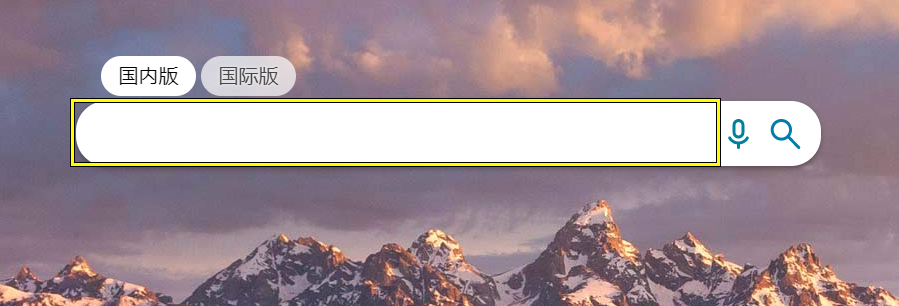
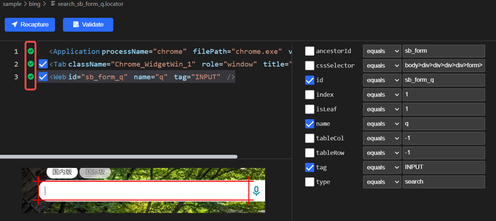
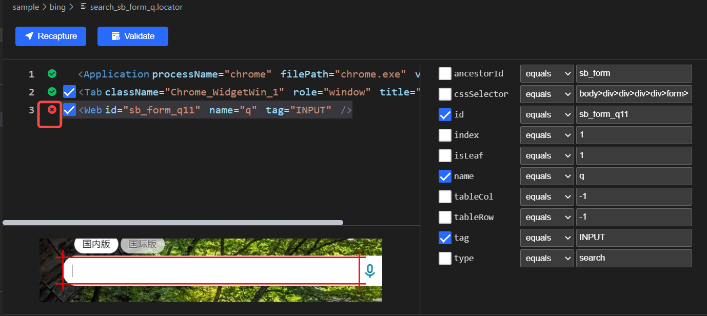
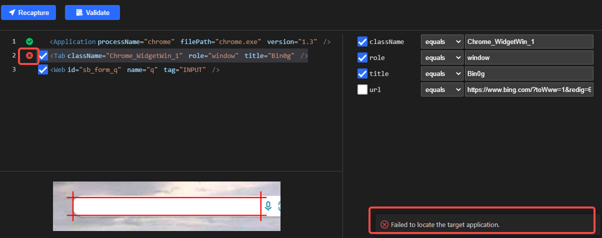
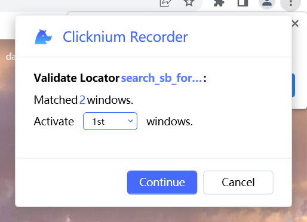
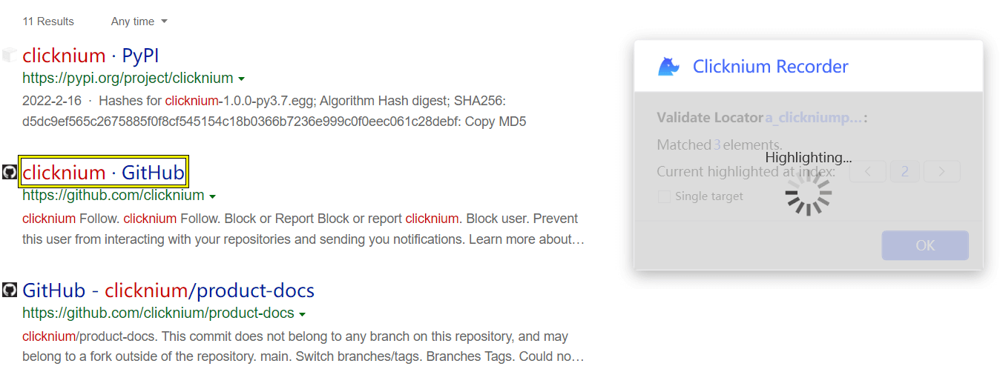
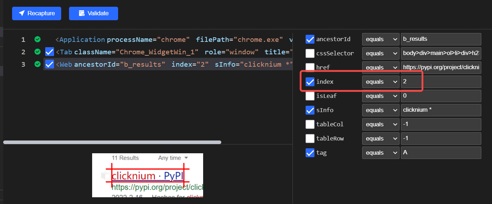

# Clicknuim Locator
A locator is a way to identify elements on a web page or desktop app.   

# Overview 
Identification of the correct GUI element on a web page is pre-requisite for creating any successful automation script, where locators come into the picture. Locators are one of the essential components of Clicknium infrastructure, which help Clicknium scripts in uniquely identifying the UI elements(such as text box, button, etc.). 
The way to get a locator for a specific UI element is the key experience of automation framework. Before using Clicknium, you have to learn some web essential knowledge, such as XPath. Clicknium provides Clicknum Recorder to help you get a locator by just clicking the elements.  

# How to use
So, how do we get the values of these locators? And how to use the same locator in the automation framework?

## Get a locator 
Clicknium provides Clicknium Recorder to get UI locators.  
- Make sure that [Clicknium Python package](./../references/python/python.md), [VS code extention](/concepts/vscode/vscode.md), [Chrome extension](/concepts//extensions/chromeextension.md) is installed. 
- Open a Python file in VS code. 
- Capture locators with Clicknium Recorder(`Ctrl + Click`).  

  

## Use locator in Python Code
Clicknium provides intellgent auto-complete experience. You can find the exsiting locators captured by Clicknium Recorder in VS Code. Select the locator class under the Clicknium package and reference Locator by `Locator.{localorStoreName}.{folderName}.{LocatorName}`  Operate locators via Python code, run and waiting for a miracle. 

## Operations Supported by the Locators

  

1. Open: open locator details in the VS Code edit window. 
2. Validate: validate the locator.
3. Copy: create a same locator under the same directory.
4. Copy Path: put the path of the locator in clipboard, so users can paste it directly in the Python code.
5. Rename: rename the locator
6. Delete: delete the locator

## Locator Editor
  

The detailed page of locator editor is organized with two parts.
- Left part: display locator tiers as XML based view  
- Right display the attribute details for the selected XML node on the left part.  

- Checkbox ①: Select the locator tier. The unchecked tier will be ignored when locating the UI element.  
- Checkbox ②：Select the properties for the selected locator tier. This unselected properties will be ignored when locating the UI element.  
- Dropdown ③: There are 4 matching operators, "equals", "contains", "startWith" and "endWith".  
  
- Input item ④：The values of the property  
    Notes：When the matching rule is "equals", the value supports wildcard characters.
    |Wildcard characters| Functions                 |
    |-------|----------|
    |*    | Substitute one or more characters |
    |?    | Substitute a character      |

## Recapture
1. Click the `Recapture` button to open the recorder and capture the locator again.
2. Capture the corresponding target UI element.
3. When recording succeeds, return to vscode and save the newly recorded element by pressing Ctrl+S.

## Locator Validation
Click `Validate` button.

### Validation succeeded
1. The recorder opens the window containing a locator and marks the corresponding element.  
  

2. Within a few seconds, it automatically returns to the vscode window and marks as correct.  
  

### Validation failed
- If the recorder cannot find the target element, it automatically returns to the VS Code and marks the locator tier that cannot be found.

  
- Notes: The application will not be opened and the corresponding URL will not be entered in the verification. If the error is marked in layer one or layer two, please confirm whether the application and URL are opened.

  

### Multiple windows exist in validation
- If multiple opened windows contain the locator at the same time, a dialog will pop up for you to select the window.

  

- After the matched window is selected, the corresponding window will be validated in a few seconds and return to vscode.

### Multiple elements are located in validation
- If multiple locators are matched in the window, a window will pop up for you to select the locator index.  
- If you switch the Index, the corresponding locator is highlighted.
  
  

- If you want to update the switched Index in a locator, check `Single target` and click `OK`. 
  
  

- After switching back to VS Code, the corresponding Index property will be updated to the last Index and checked. 
  
  

## Locator Error Hint
### Error Type
- The UI or find_element function argument must be a locator. If it is a store or a folder, an error message will be displayed.

### Locator Does Not Exsit
- If the entered locator does not exist in the referenced store, an error message is displayed.

- Select `Quick Fix` to start the recorder. After recording elements, a locator that does not exist will be named to generate a locator.
  
## Locator Hover
- If you hover the mouse to the locator in the code, the locator content is displayed for easy identification.

- `Open`: Open the corresponding locator to edit
- `Validate`: Validate the locator
- `Recapture`: Start the recorder to capture the locator again. If the recorded locator is different from the one in the editing window, it will be saved directly. 

## Auto Fill
1. Press the shortcut key CTRL+F10 or click  `Capture` in the right menu to start the recorder.
2. After recording, select a locator that is required to fill in the recorder.
3. After clicking `OK`, the locator will be automatically filled into the code.

