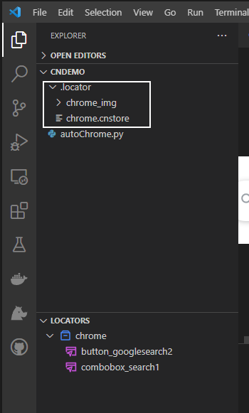

# Locator Store
Locator Store is where Clicknium stores locators. 

# Overview
Clicknium provides locator store to help developer manage locators. Locators will be sent into locator store automatically after captured by Clicknium Recorder. You can edit and manage locators in the store. Python code intelliSense will auto update in real-time. There are two types of locator store: **Local Locator Store** and **Cloud Locator Store**. It supports to switch from either one to other. 

# Locator Store Type
- Local locator Store
- Cloud locator Store

## Local Locator Store
Local locator Store will auto generate by default after the recorder captured first locator. Local locator store is a file in the project root path that store the locators. According to the implementation, the store will go with the Python project and it cann't be share to another project. On the other hand, it also means that the code can run offline. 

## Cloud Locator Store 
Cloud Locator Store is powered by Clicknium. After a successful log-in, cloud locator store will be 