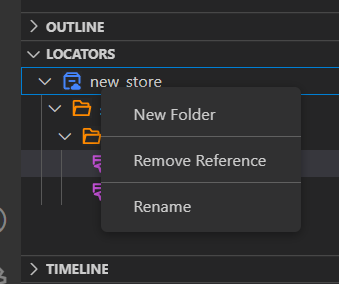

# Locator Store
Locator Store is where Clicknium stores locators. 

# Overview
Clicknium provides locator store to help developer manage locators. Locators will be sent into locator store automatically after captured by Clicknium Recorder. You can edit and manage locators in the store. Python code intelliSense will auto update in real-time. There are two types of locator store: **Local Locator Store** and **Cloud Locator Store**. It supports to switch from either one to other. 

# Locator Store Type
There are two types of locator store:
- Local locator Store
- Cloud locator Store

## Local Locator Store
Local locator Store will auto generate by default after the recorder captured first locator. Local locator store is a file in the project root path that store the locators. According to the implementation, the store will go with the Python project and it cann't be share to another project. On the other hand, it also means that the code can run offline. 

## Cloud Locator Store 
Cloud Locator Store is powered by Clicknium. After a successful log-in, cloud locator store will be connected. It can be referenced into the current project. The frequently-used locators are approperiated to store in cloud locator store so that can be shared in different projects, event different person. The Python script can run anywhere with Internet access. 

### How to choose
Local locator stores:  
#### Pros:
- Offline run.
#### Cons:
- Need to record earch locator for every project.
- Can't be shared cross projects/computers.

Cloud locator stores:
### Pros:
- Record once, can be use anywhere, across project/computer.
- If UI changes break locator, one fix is enough for all project. 
###
 - Need Internet access. 

# Locator Store Management
You can manage Clicknium Locator Store in Clicknium Recorder, Your projects and Clicknium VS Code panel for the Cloud Store. The experience is totally same. When you modify the locator store, please refresh in other place.  
 
Supported Store Operation:
- Create new store
- Rename store name: please notice it might break existing code. The store name is one part of identity of locaters. The referenced code needs to be updated accordingly.
- Folder: create/update/delete a new folder under the a store to group locaters.   
- Remove Reference：remove the referenced store in the project.  
- Convert to Cloud/Local locater store: locator store can be convert to local or cloud seamlessly.

You can create multiple stores. Folders can be create under a store to manage locaters better. 

  

# Local Locator Management
Local locator store can be find at VS Code Explorer under `LOCATOR` tab. The editor experience is same with cloud locator store.   
## Edit Store

  

# Manage Cloud Locator Store
## Enter into 'Cloud Locators' panel
Click 'Clicknium Explorer' button in Visual Studio Code Activity Bar to show 'CLOUD LOCATORS' panel.  
If you don't sign in yet, click 'Sign in' button to navigate to Clicknium webpage to sign up or sign in.
For more information, please refer to [Connect to Cloud](./vscode/connecttocloud.md).  
You can see the cloud locator store lists.  

## Capture locators  
Click 'Capture' button on the right side of one cloud locator store to invoke 'Clicknium Recorder', then you can capture and manage the locators in the locator store.  

  
For more information, please refer to [Clicknium Recorder](./recorder/recorder.md)  

## Reference cloud locator store to project
Click `Reference` button on the right side of one cloud locator store.  

  
The locator store will be referenced to the current project. 

  