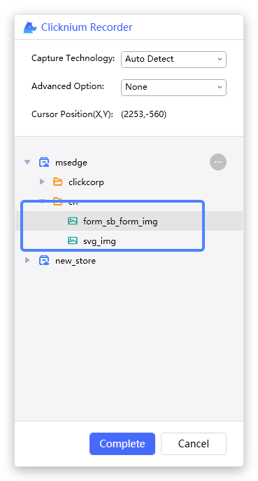
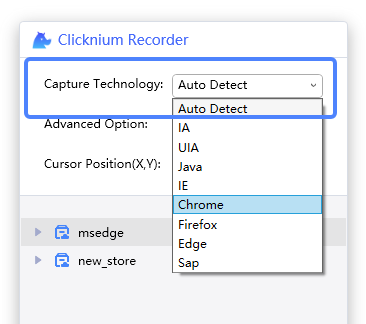

# Capture

## How to start recorder
- Start from Visual Studio Code LOCATORS tab  

- Strat from Visual Studio Code CLOUD LOCATORS tab  

- Start with pressing hotkey `Ctrl+F10`  

## Capture methods

Clicknium provides three recording methods: single capture, continuous capture and image capture.

> **Remarks:**
>- The new recorded locator will be added into current selected store.

### Select capture technology and advanced option
We can select the capture technology and the advanced option with each capture method. For more information, please refer to [Capture Technology](#capture-technology) and [Capture Advanced Option](#capture-advanced-option).

### Single capture

1. Select UI element  
When mouse moving, it will highlight the UI element, and show its position on recorder panel.

2. Press `Ctrl + click`
3. Click the button `Complete`  

### Continuous capture

1. Operate for multiple times by "Selecting UI element and Pressing `Ctrl + click`" to add more locators
2. Click the button `Complete` on recorder panel

### Image capture

1. Select a UI element  
2. Press `Shift` and select one area for the element with the mouse
3. Validate image locators as below:  

4. Click the button `Complete` on recorder panel

## Capture technology

The supporting capture technologies are as follows `UIA`, `IA`, `Java`, `IE`, `Chrome`, `Firefox`, `Edge` and `Sap`.  
The default technology is `Auto Detect`, which means the recorder will automatically select the technology.  
For web UI element, you can choose `IE`, `Chrome`, `Firefox` or `Edge` capture technology according to your browser type.  
For SAP application, you can choose `Sap` capture technology.  
For Java application, you can choose `Java` capture technology.  
For window UI element, you can choose `UIA` or `IA` capture technology.  
 

## Capture advanced option

Default advanced option is `None`. When recording web UI element, you can also select XPath to generate a XPath string.    
