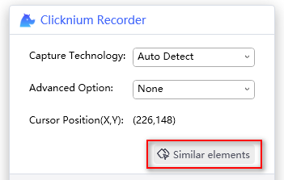
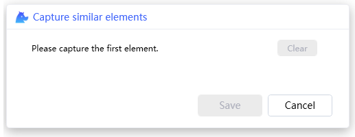
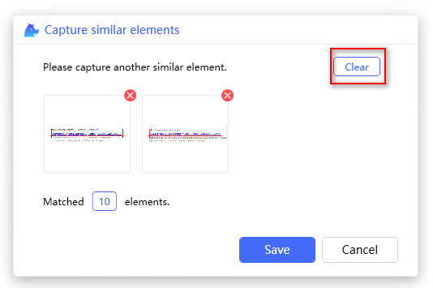

# Capture Similar Elements

"Similar elements" means UI elements with similar structure, like a list of items, or field of a list. Locators generated by this feature can be used in case of a list of UI elements need to be processed in automation.  

- [Capture Similar Elements](#capture-similar-elements)
  - [Start recorder](#start-recorder)
  - [Capture wizard](#capture-wizard)
  - [Start capture](#start-capture)
  - [Highlight elements](#highlight-elements)
  - [Clear elements](#clear-elements)
  - [Remove element](#remove-element)
  - [Cancel capture](#cancel-capture)
  - [Recapture](#recapture)

> **Remarks:**
>- Only support web UI element for now.  
>- Xpath locator is not supported by this function.  
>- Image locator is not supported.  

## Start recorder
- Start from Visual Studio Code LOCATORS tab  

- Strat from Visual Studio Code CLOUD LOCATORS tab  

- Start with keyboard shortcut `Ctrl+F10` in code.   

## Capture wizard  
Click on the `Similar elements` button, a wizard window will be displayed.
- Click  `Similar elements` button

- Capture similar elements wizard 

## Start capture

1. Capture first element  
Move mouse cursor to one UI element of target list, it will highlight the element, then press `Ctrl+click` to capture the locator. The element image will be added to the wizard. A locator for this element will be generated accordingly and matched elements count for this locator will be displayed below the image.  
  

2. Capture another element  
Move mouse cursor to another element of the target list, then press `Ctrl+click` to capture it. The image will be added to wizard, and locator will be updated accordingly to reflect the captured elements. You may check if the matched elements count is expected to determine if more elements are needed to be captured.  
  

3. Save the locator  
Click `Save` to save the locator, the locator for matching similar elements will be added to the locator store.  
  

## Highlight elements
 Highlight all matched elements for several seconds to determine if the generated locator is correct.  
  
Click the matched elements count button   
  

## Clear elements
Clear all the elements captured in the wizard window by clicking the right-top `Clear` button. It is normally used if the matched elements are not expected and you want to startover. Once clicking the button, the elements are removed and the `Clear` and `Save` buttons are disabled when there is no data.  
- Click the `Clear` button  
 

## Remove element
Remove one element in the wizard window.  
- Click the `Remove` button  
  

## Cancel capture
Discard the current capture result and return to the main capture window.  
- Click the `Cancel` button  
  

## Recapture
Recapture similar element can be used to update your single locator or similar locator.
1. Start from Visual Studio Code   
  
2. Click `Similar elements` button  
  
3. Follow steps in [Start capture](#start-capture) to generate the locator. After clicking `Save` button, the locator in store will be replaced by the recaptured one. 