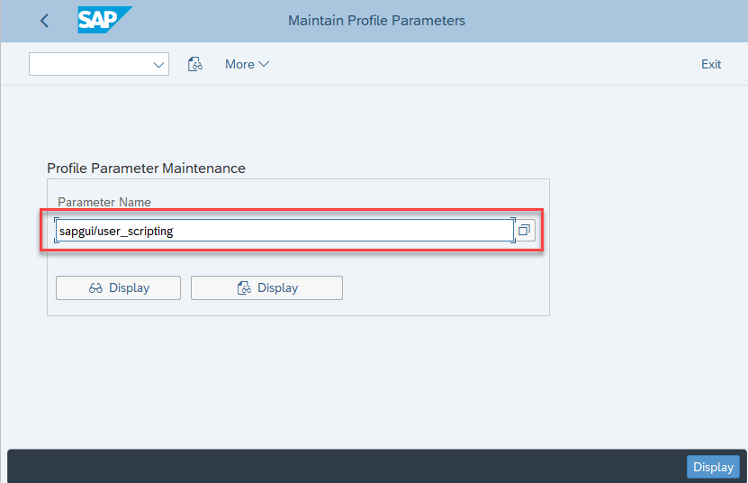
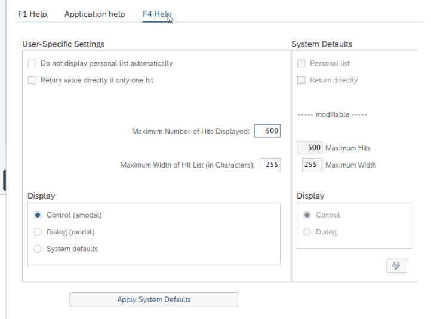

# SAP WinGUI Automation

## Overview
SAP WinGUI is commonly used to access SAP functionality in SAP applications.
Clicknium supports SAP WinGUI automation, and it requires the SAP WinGUI API scripting enabled.

The  version 7.4 ,7.5 and 7.6 of SAP WinGUI are supported.

  
The following functions specified for SAP are supported:
- [login](./../references/python/sap/login.md)
- [select_item](./../references/python/sap/sapelement/select_item.md)
- [call_transaction](./../references/python/sap/sapelement/call_transaction.md)
- [get_statusbar](./../references/python/sap/sapelement/get_statusbar.md)  

Other general functions are also supported for SAP WinGUI element, such as click, set_text, get_text etc.

## Enabling SAP WinGUI API scripting
### Server Side Configuration
1. Launch `saplogon`, log onto SAP server
2. Run transaction code `RZ11`  
  
3. Input the parameter name `sapgui/user_scripting`, click button `Display`  
  
4. In the dialog `Display Profile Parameter Attributes`, click button `Change Value`, set ***Current Value*** to `TRUE`, and then save the changes.
  
5. Repeat step 4, set the following parameters's value to `FALSE`
- sapgui/user_scripting_disable_recording
- sapgui/user_scripting_force_notification
- sapgui/user_scripting_per_user
- sapgui/user_scripting_set_readonly
  
Notes: All changed values in transaction `RZ11` are temporary and lost after the system restarts. For changes permanent, please contact SAP System Administrator.
 

### Client Side Configuration
1. Select menu `Options` 
2. Go to Accessibility & Scripting and click on Scripting.
3. Check the Enable scripting option.  
  
4. Clear the checkbox for the following options:
- Notify when a script attaches to SAP GUI
- Notify when a script opens a connection
5. Save the changes by clicking OK. The SAP WinGUI scripting is now enabled.

### Enabling Modal Dialog Boxes
1. From the SAP Easy Access window, click Settings under the Help menu. The Personal Settings for User window is displayed.  
  
2. Access the F1 Help tab and select the in Modal Dialog Box option from the Display section.  
  
3. For date selection, access the F4 Help tab, and select Control (amodal) option from the Display section.  
  
4. Click the Apply button to save changes and close the Personal Settings for User window.