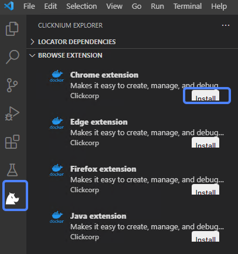
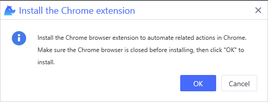
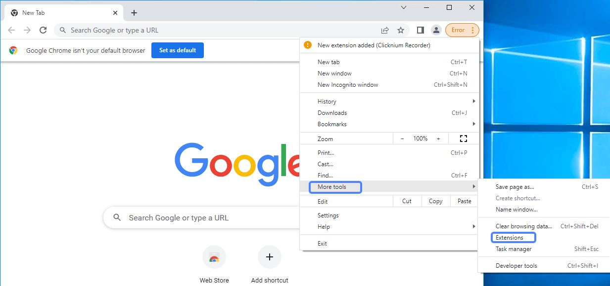
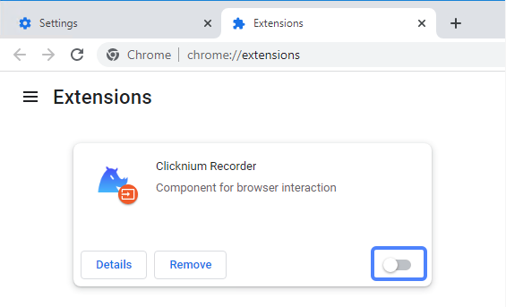

# Chrome Extension<!-- {docsify-ignore-all} -->

**You can automate the chrome browser by installing the Chrome extension.**

> **Remarks:**
>
>- It is recommended to use the official version of the Chrome browser, and the green version or the forum customized version of the Chrome browser is not recommended.
>- The minimum Chrome version is 60.
>- Before installing the extension, you may be asked to close Chrome browser, so make sure to save the relative jobs in processing.

## Install

1. You can install the extension from [VSCode Clicknium Extension](./doc/developtools/vscode) or use [Clicknium Python Sdk](./doc/api/python/webdriver/webextension/webextension)

    - install from [VSCode Clicknium Extension](./doc/developtools/vscode)  
        
    - install from [Clicknium Python Sdk](./doc/api/python/webdriver/webextension/webextension)
    ```python
    from clicknium import clicknium as cc

    # install chrome extension
    cc.chrome.extension.install()
    ```

2. Click "OK" in below pop-up dialog box.  
    &emsp;&emsp;

3. When the installation finish, click "OK" in below pop-up dialog box.  
    &emsp;&emsp;  

4. Turn on extension in Chrome browser  
    4.1 Open Chrome browser and click "More Tools > Extensions" in the side navigation bar  
    &emsp;&emsp;  
    4.2 In the opened page , find the "Clicknium Recorder" extension.  
    &emsp;&emsp;  
    4.3 Click the Enable button in the lower right corner of this extension.  
    &emsp;&emsp;

5. You can refer to console output for more installation details.