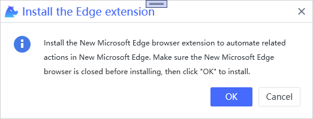
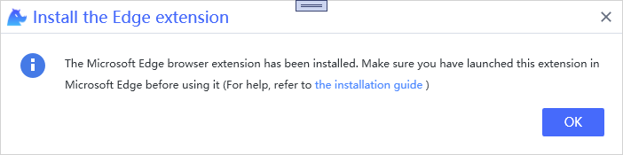
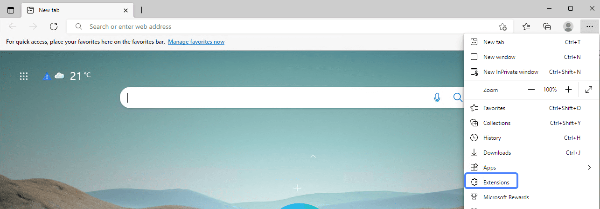
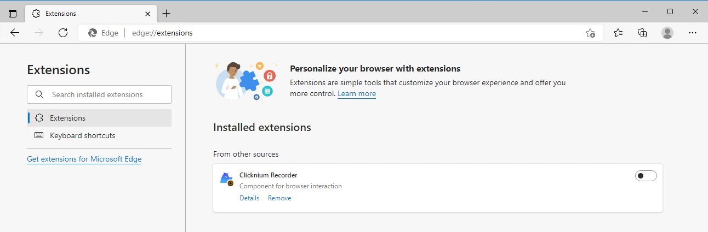

# Microsoft Edge Extension<!-- {docsify-ignore-all} -->

**You can automate Edge by installing the Microsoft Edge extension.**

> **Remarks:**
>
>- Before installing the extension, you may asked to close Microsoft Edge browser to make sure to e the relevant jobs in processing are saved.

## Install

1. You can install the extension in [VSCode Clicknium Extension](./doc/developtools/vscode) or [Clicknium Python Sdk](./doc/api/python/webdriver/webextension/webextension)

    - install the extension in [VSCode Clicknium Extension](./doc/developtools/vscode)  
        
    - install the extension in [Clicknium Python Sdk](./doc/api/python/webdriver/webextension/webextension)
    ```python
    from clicknium import clicknium as cc

    # install edge extension
    cc.edge.extension.install()
    ```

2. Click "OK" in below pop-up dialog box.  
    &emsp;&emsp;

3. When the installation is finished , click "OK" in below pop-up dialog box.  
    &emsp;&emsp;  

4. Open the extension in Edge  
    4.1 Open Edge and click "Extensions" in the side navigation bar  
    &emsp;&emsp;  
    4.2 In the open page , find the "Clicknium Recorder" extension.  
    &emsp;&emsp;  
    4.3 Click the button "Enable" in the lower right corner of this extension.  
    &emsp;&emsp;

5. You can refer to console output for more installation details.