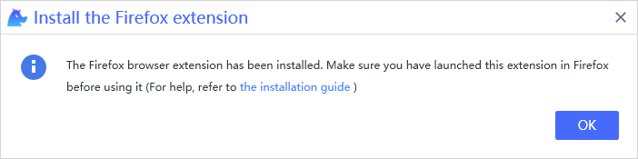

# Firefox Extension<!-- {docsify-ignore-all} -->

**You can automate the firefox browser by installing the Firefox extension.**

> **Remarks:**
>
>- The minimum Firefox version is 56.
>- Before installing the extension, you may be asked to close Firefox browser, so make sure to save the relevant jobs in processing.

## Install

1. You can install the extension from [VSCode Clicknium Extension](./doc/developtools/vscode) or use [Clicknium Python Sdk](./doc/api/python/webdriver/webextension/webextension)

    - install from [VSCode Clicknium Extension](./doc/developtools/vscode)  
        
    - install from [Clicknium Python Sdk](./doc/api/python/webdriver/webextension/webextension)
    ```python
    from clicknium import clicknium as cc

    # install firefox extension
    cc.firefox.extension.install()
    ```

2. Click "OK" in below pop-up dialog box.  
    &emsp;&emsp;

3. When the installation finish, click "OK" in below pop-up dialog box.  
    &emsp;&emsp;  

4. Turn on extension in firefox browser  
    Open firefox browser and in the opened page, find the "Clicknium Recorder" extension, and add it.  
    &emsp;&emsp;

5. You can refer to console output for more installation details.