# Project Management

## Overview
Clicknium project encapsulates python automation files to guarantee the automation scripts having same result in developing, debugging, execution and distribution. 

## Create Project

In Visual Studio Code, press `Ctrl+Shift+P` to show the Command Palette, input or select `Clicknium: Create Project`, and then select a folder where the project is stored according to the pop-up window.
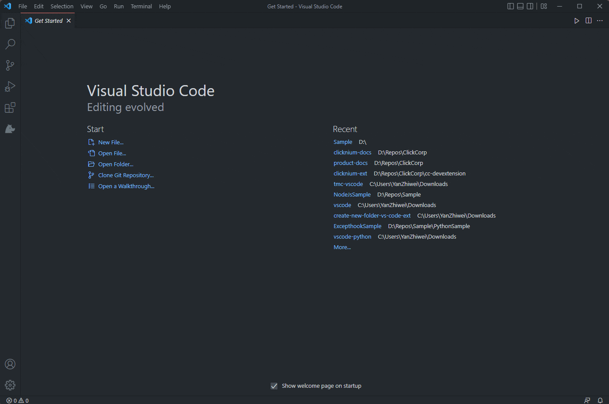

When the project is created, a pop-up window in the lower right corner shows the general project intialization information and the output panel shows details. After initialization, the current Python virtual enviroment can be seen when you open app.py.  
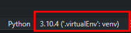

### Project Structure

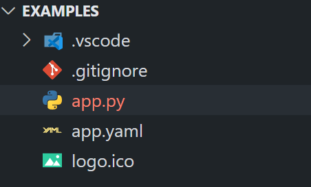

1. **app.py**:a python file where the main function is the execution entry of the project.
   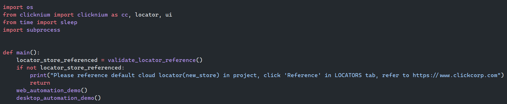

2. **clicknium.yaml**:configuration file where you can configure python version, python packages, project entry file and locator store references, etc for the project.  
   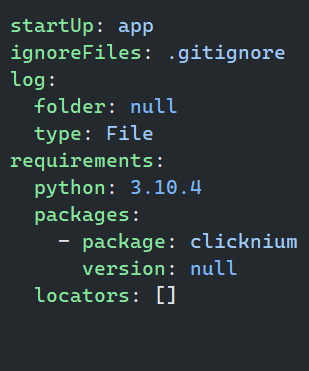
   
   - **startUp**: The project entry file, if you want to change the project run entry file to another file, fill the file name without suffix in this field.  
   
   - **log**：The project log. Its property "folder" indicates the location of the log files to be saved. If its value is not specified, it will use default location %LOCALAPPDATA%\Clicknium\Log.
   
   - **requirements**：running project dependency.  
     &emsp;Python: Python version is 3.7.0 by default. In creating project, if Visual Studio Code already has at least one supported version Python installed, clicknium extension will choose current selected python interpreter to create the project, the python version in this configuration file will be updated accordingly. If Visual Studio Code does not have Python installed, clicknium extension will install Python 3.7.0 as described in configuration file by default.
     
     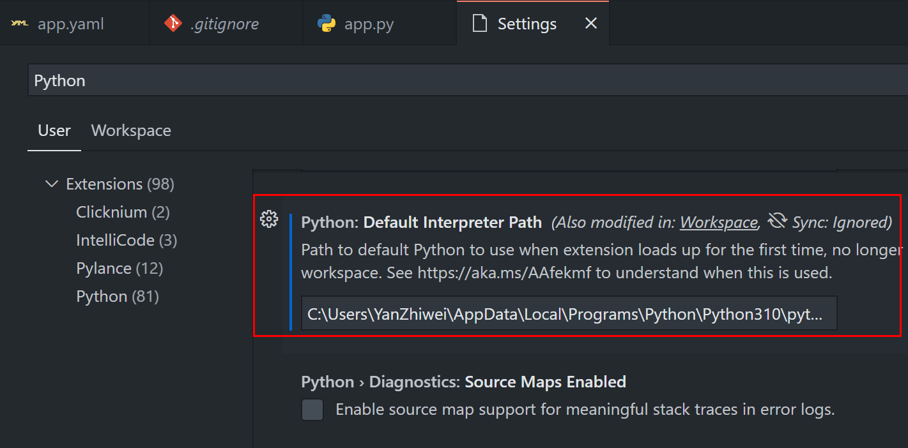  
     &emsp;Packages：Python package dependency. In this configuration, you can add one or more Python packages required by this project in the format of package-version. If the version is blank or null, the latest version will be used automatically.  
     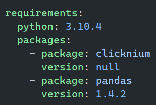  
     &emsp;If there is no required Python package dependency，it will be configured as [].  
       
     &emsp;locators: The cloud locator repository dependency, configured in the same way as Python package dependency.

3. **logo.ico**：The icon of executable file after packaging the project. You may replace this file if you want customize the executable file icon.  

4. **.gitignore**：When using Git, you can add or remove files that you want to ignore.

## Run/Debug Project

### Run the project

In Visual Studio Code, press "Ctrl+Shift+P" to show the Command Palette, input or select "Clicknium: Run Project". The clicknium extension will deploy and run the project based on clicknium.yaml.
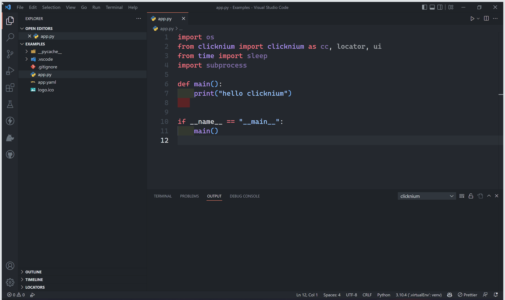 

### Debug the project

#### Basics

In Visual Studio Code, set a breakpoint to the code where you want to pause,
press `Ctrl+Shift+P` to show the Command Palette, input or select "Clicknium: Debug Project". The clicknium extension will start projec debugging with debug buttons shown at the top of Visual Studio Code.  
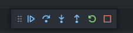  
&emsp;Continue (F5) / Pause (F6)  
&emsp;Step over (F10)  
&emsp;Step in (F11)  
&emsp;Step out (Shift + F11)  
&emsp;Restart (Ctrl+Shift+F5)  
&emsp;Stop (Shift + F5)  
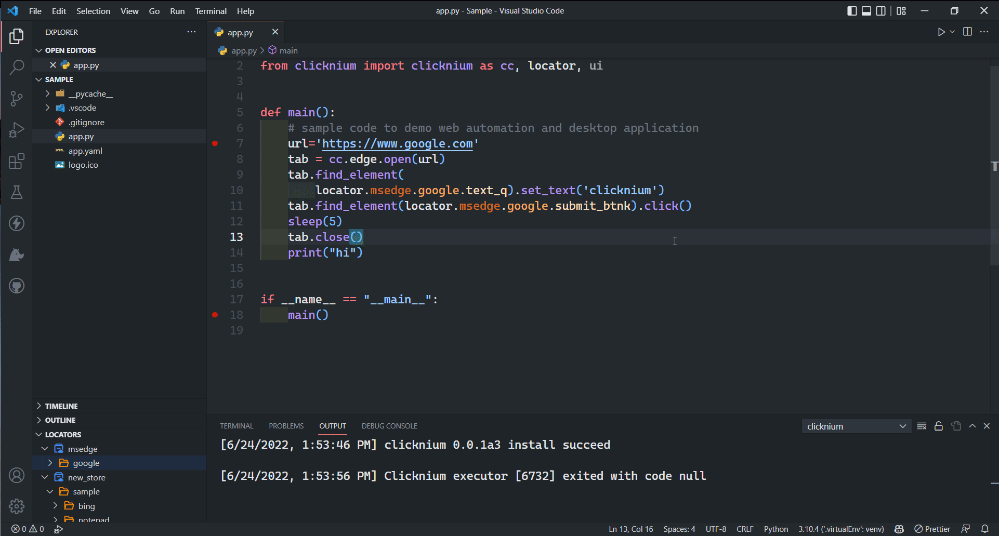

#### Monitor Variables

In the upper left corner of Visual Studio Code, you can see the variables is debugging the running values.  

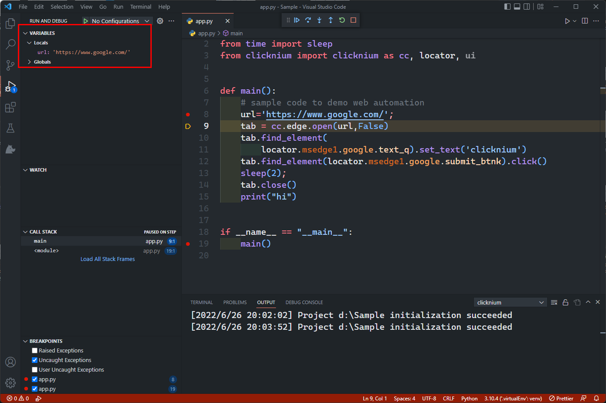

#### Debug Console

In Visual Studio Code, open the debug console by "View -> Debug Console"   

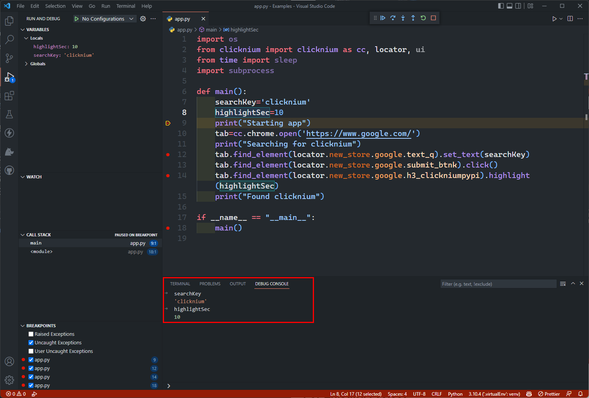
