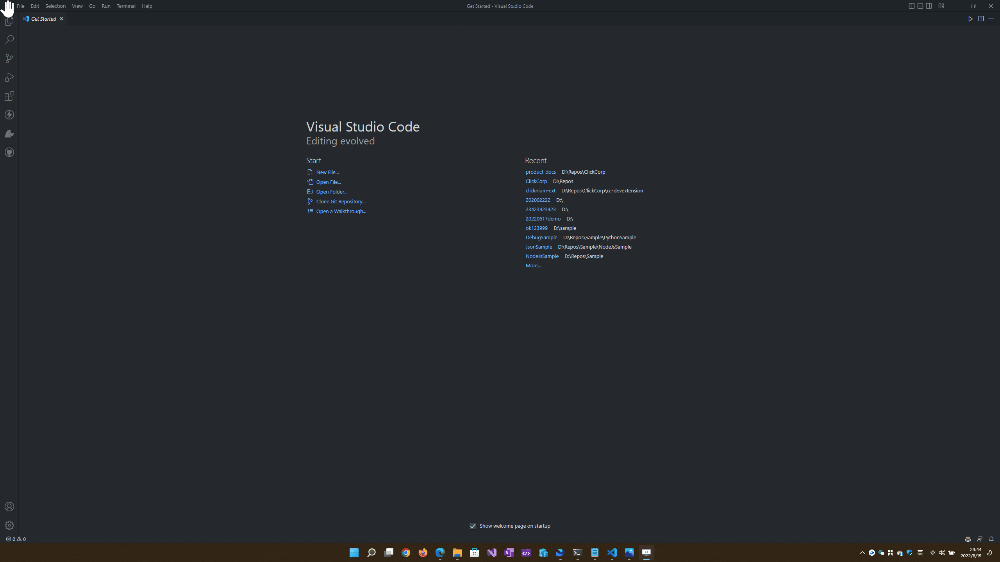

# Create Project

In Visual Studio Code, press "Ctrl+Shift+P" to show the Command Palette, and enter "Clicknium" to select and show "Create Clicknium Project". Press "Enter", and select the folder where the project is stored according to the pop-up window. 

When the project is created, a pop-up window in the lower right corner shows the general restored project information and the bottom page shows details. After restoring, the current Python virtual enviroment can be seen when you open app.py.

## Project Structure

In Visual Studio Code, press "Ctrl+Shift+P" to show the Command Palette, and enter "Clicknium" to select and show " Run". When you press "Enter" to run the project, Clicknium extension will deploy the project running process based on app.yaml.

1. **app.py** an automation scripts file where the main function is the entry function for runing the project.
   

2. **app.yaml** configuration files where you can configure the project, Python version, Python package, project entry file, cloud element repository, etc.
   
   
   - startUp: The project entry file, if you want to change the project run entry file to main.py, fill out "main" to configure it.
   
   - log：The project log, currently supporting the local log where "Folder" indicates the path of the Log storage Folder. If this parameter is  blank or null, it will be automatically stored in the Log file starting with %LOCALAPPDATA%\Clicknium\Log\Folder Automation.
   
   - requirements：running project dependency
     &emsp;Python:Python version is 3.7.0 by default.In the creating a project, Clicknium extension automatically reads the current Default Interpreter Path Settings in Python Settings in Visual Studio Code. If this setting uses neither Python virtual environment path nor the Python embedded version path, Clicknium extension read this setting to change the Python version to the configuration. 
     
     
     &emsp;packages：Python package dependency. In this configuration, you can add one or more Python packages requrired in projects in the format of package-version. If the version is blank or null, the latest version will be used automatically.
     
     If there is no need for  Python package dependency，it will be configured as [].
     
     &emsp;locators: The cloud element repository dependency, configured in the same way as Python package dependency.

3. **logo.ico**：Generate the file with exe icon when packaging the project, and it can be replaced with the needed icon file.

4. **.gitignore**：When using Git, you can add or remove files that you want to ignore.
   
   

# Run/Debug Project

## Run the project

In Visual Studio Code, press "Ctrl+Shift+P" to show the Command Palette, and enter "Clicknium" to select and show " Run". When you press "Enter" to run the project, Clicknium extension will deploy the project running process based on app.yaml
 

## Debug the project

### Basics

In Visual Studio Code, set a breakpoint on the right side of the code editing window at first,
press "Ctrl+Shift+P" to show the Command Palette, and enter "Clicknium" to select and show " Debug". When you press "Enter" to run the project, Visual Studio Code will be debuging with the debug button shown at the top. 

&emsp;Continue (F5) / Pause (F6)
&emsp;Step over (F10)
&emsp;Step in (F11)
&emsp;Step out (Shift + F11)
&emsp;Restart (Ctrl+Shift+F5)
&emsp;Stop (Shift + F5)

### Monitor Variables

In the upper left corner of Visual Studio Code, you can see the variables is debugging the running values.

### Debug Console

In Visual Studio Code, open the debug console by "View -> Debug Console" 

