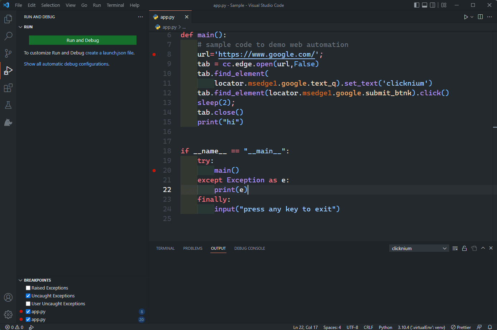
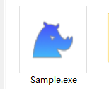

# Package Project

In Visual Studio Code, press "Ctrl+Shift+P" to show the Command Palette, and enter "Clicknium" to select and show "Package Project". Press "Enter", and select the path to save the executable file.

The detailed package log Output displays in the Output in Visual Studio Code.

When the package is complete, the save folder is opened automatically to find the Exe file. 

If you want to replace the Exe icon, replace the logo.ico file in the project file. 
