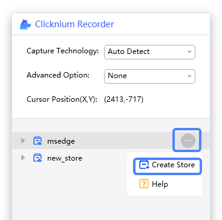
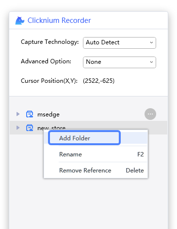
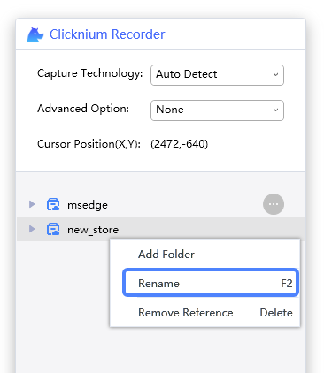
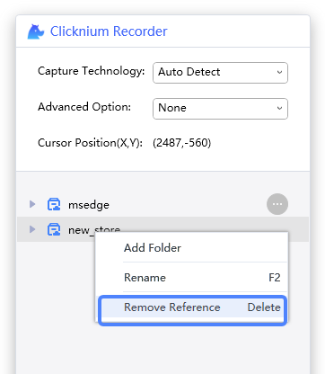
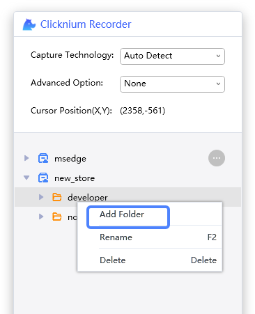
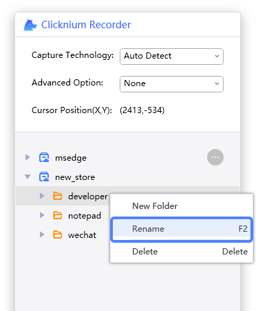
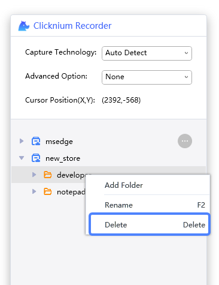
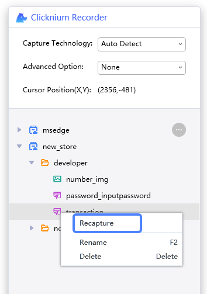
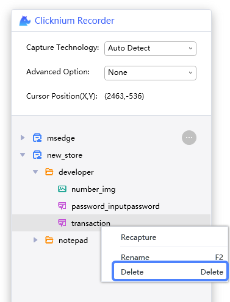

# Locator Management

## Store Management

Clicknium supports the following store operations: create, rename, add folder and remove the reference of the current project.

### Create
Create a new store with a new name. Select the store, and the locators will be added to the selected store.  
- Click the button `Create Store`
- Input the store name
- Save by pressing `Enter` or `Tab`  
 

### New Folder
Create a new folder under the selected store. Select the folder, the locators will be added into the selected folder.  
- Click the button `New Folder`
- Input a folder name
- Save by pressing `Enter` or `Tab`  

### Rename
Rename the selected store.  
- Click the button `Rename` or press `F2`
- Input a new store name
- Save by pressing `Enter` or `Tab`  

### Remove Reference
Remove the reference of the selected store.  
- Click the button `Remove Reference`  
- Click the button `Yes`  

## Folder Management

We support the three types of folder operations: rename, new folder and delete.

### New Folder
Create a new folder under selected folder.
- Click the button `New Folder`
- Input folder name
- Save by pressing `Enter` or `Tab`  

### Rename
Rename the selected folder with new name.  
- Click the button `Rename` or press `F2`
- Input new store name
- Save by pressing `Enter` or `Tab`  

### Delete
Delete the selected folder.
- Click the button `Delete`  
- Click the button `Yes`   

## Locator Management
For locator operations, we support rename, new folder and delete.

### Recapture
Recapture a new locator with selected locator name. For more infomation, you can refer to [Recapture](./recapture.md).  

### Rename
Rename the selected locator with new name.  
- Click the button `Rename` or press `F2`
- Input new store name
- Save by pressing `Enter` or `Tab`  

### Delete
Delete the selected locator.
- Click the button `Delete`  
- Click the button `Yes`  
