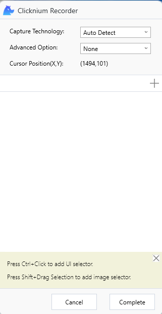
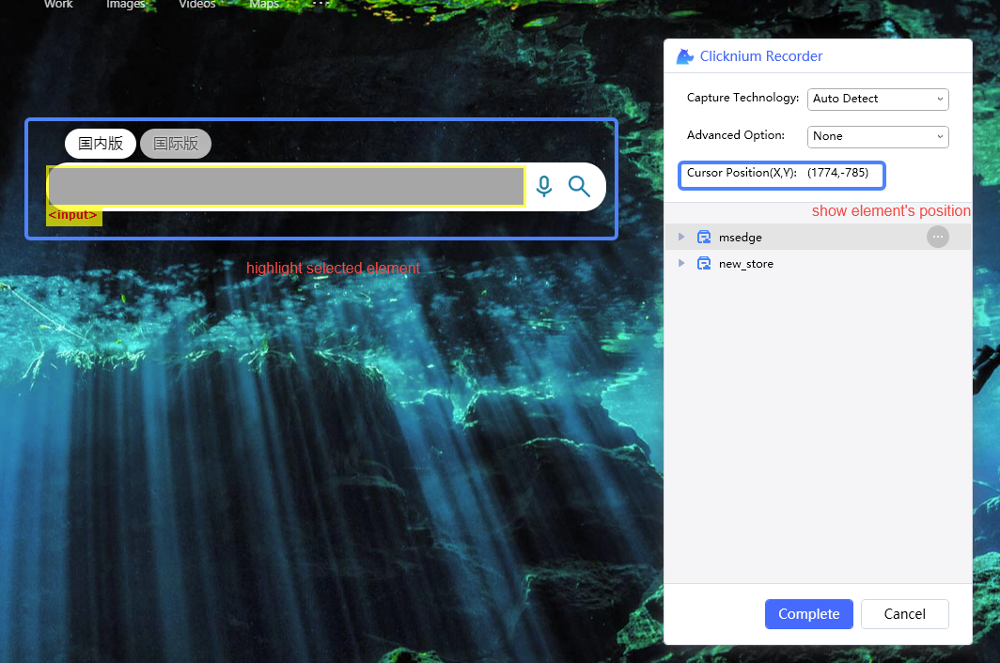
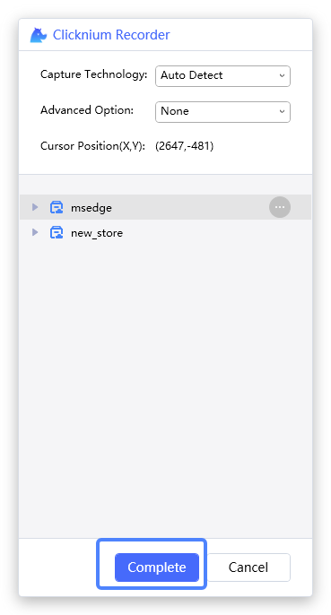

# Quick Start<!-- {docsify-ignore-all} -->

Follow this tutorial to start record a locator quicky.

- Find LOCATORS tab, then press button `Capture` as follows:  
&emsp; 

- The recorder window popuped as follows:  

- Select UI element  
When mouse moving, it will highlight the UI element, and show its position on recorder panel.

- Press `Ctrl` + click

- Press button `Complete`  

