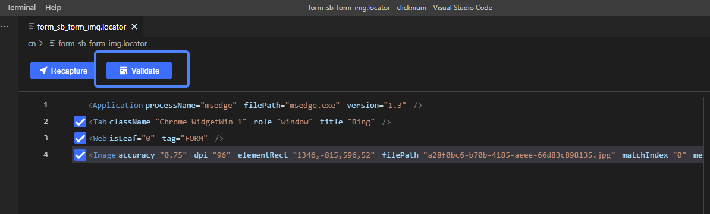
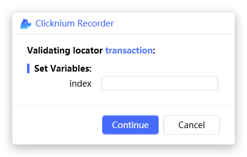
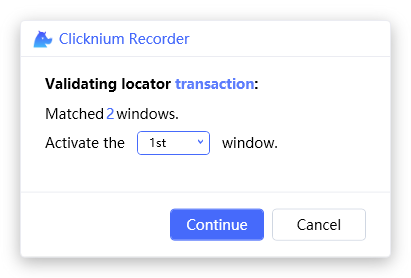
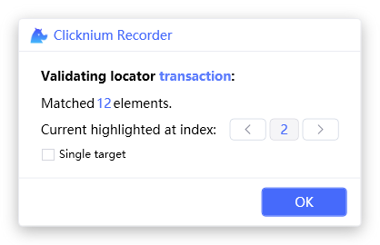
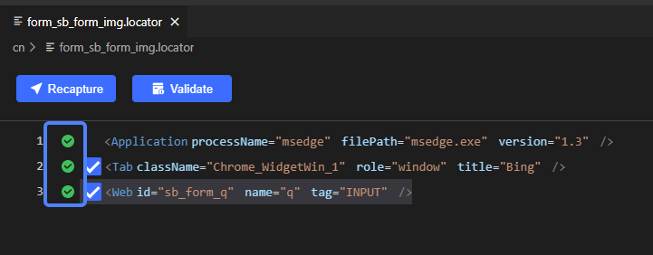
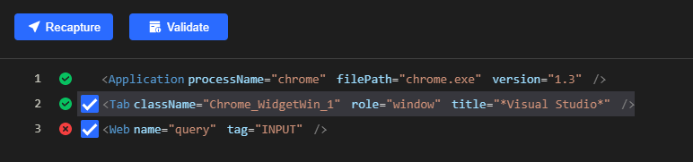

# Validate

Validate the locator. 

## Start validate
You can start "validate" from the locator viewer tab in Visual Studio Code.  

## Locator validation
### Single locator

Click the button `Validate`, and get the validation result referring to [Validation result](#validation-result).

### Single locator with variables

1. Capture a locator, and modify the locator with variables, for more about variables, please refer to [Parametric Locator](./../../automation/parametric_locator.md).

2. Click the button Validate, and a pop-up window will show as below:    

3. Input the value of the variable, and click the button `Continue`
4. Get validation result referring to [Validation result](#validation-result)

### Single locator with mutiple windows
1. If a single locator is found in multiple windows, click the button `Validate`, a pop-up window will show as below:    

2. Get a correct window by selecting the index of window, and click the button `Continue`
3. Get validation result referring to [Validation result](#validation-result)

### Mutiple similar locators
1. Capture a locator, and modify the locator with wildword as follows:

2. Select the index of the element, then click the button `OK`  

3. Get validation result referring to [Validation result](#validation-result)

## Validation result
- When validation is successful, the UI element will be highlighted, and locator viewer tab in Visual Studio Code will show as below:

- When validation fails, the locator viewer tab in Visual Studio Code will show as below:

