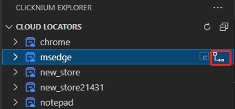
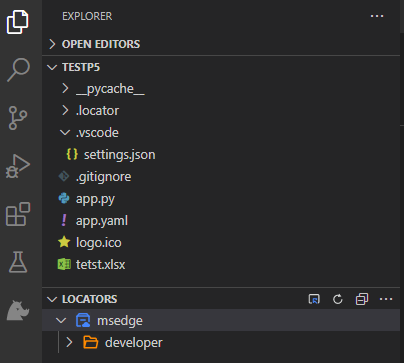

# Cloud Locator Management
## Enter into 'Cloud Locators' panel
Click the button 'Clicknium Explorer' in Visual Studio Code Activity Bar to show 'CLOUD LOCATORS' panel.  
If you don't sign in yet, click button 'Sign in' to navigate to ClickCorp webpage to sign up or sign in.
For more information, please refer to [Connect To Cloud](./connecttocloud.md).  

  

You can see the list of your cloud locator stores.

## Manage Cloud Locator Store
- Capture locators  
Click 'Capture' button on the right side of one cloud locator store to invoke 'Clicknium Recorder', then you can capture and manage the locators of the locator store.  

  
For more information, please refer to [Clicknium Recorder](./recorder/recorder.md)  
- Edit the existing locator  
Click to open one locator, and you can edit the attributes of the locator.
For more about editing locator, please refer to [Edit locator](./../../developtools/vscode/locator_management.md#edit-locator).
- Rename the locator, the folder and the store  
Right click on the target locator, folder or store, and choose `Rename` button on the pop-up menu to input the new name.
- New folder  
Right click on the target folder or store, and choose `New Folder` button on the pop-up menu to name the folder.
- Move the locator/folder  
You can drag the locator from existing folder/store to the target folder/store.
- Delete locator, folder, locator store  
Right click on the target locator, folder or store to choose `Delete` button on the pop-up menu.

## Reference cloud locator store to project
Click `Reference` button on the right side of one cloud locator store.  

  
The locator will be referenced to the current project. 

  