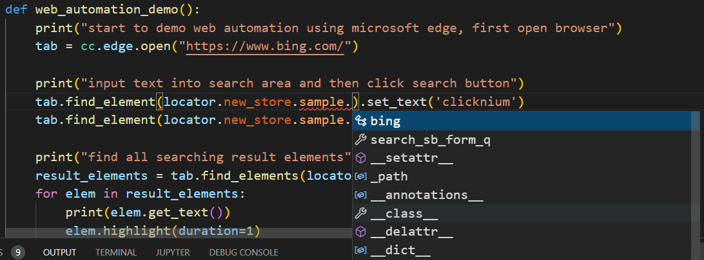
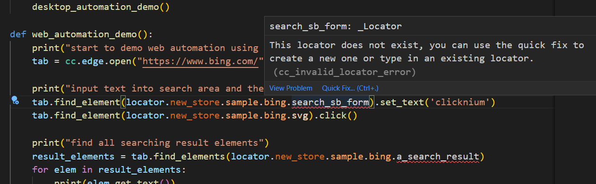
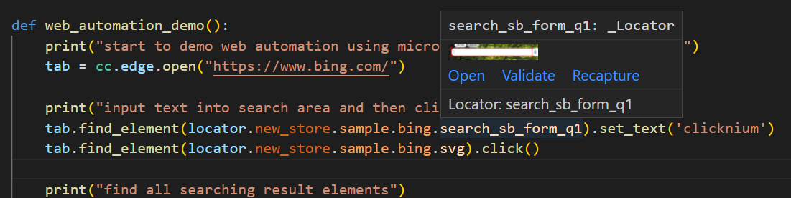

# Code IntelliSense<!-- {docsify-ignore-all} -->

  - [Code Complete](#code-complete)
  - [Locator Error Hint](#locator-error-hint)
  - [Locator Hover](#locator-hover)
  - [Auto Fill](#auto-fill)

## Code Complete
Use the locator under the Clicknium repository.  When the character "." after the locator is entered, the Store referenced in the project is automatically displayed. When the character "." after Store is entered, folder and locator under  Store are displayed.  

## Locator Error Hint
### Error Type
- UI or find_element function argument must be locator. If it is store or folder, an error message will be displayed.

### Locator Does Not Exsit
- If the entered locator does not exist in the referenced store, an error message is displayed.

- Select Quick Fix to start the recorder. After recording elements, a locator that does not exist will be named to generate a locator.
  
## Locator Hover
- If you hover the mouse to the locator in the code, the locator content is displayed for easy identification.

- Open: Open the corresponding locator to edit
- Validate: Validate the locator
- Recapture: Start the recorder to record the locator again. If the recorded locator is different from the one in the editing window, it will be saved directly. 

## Auto Fill
1. Press the shortcut key CTRL + F10 or click  "Capture" in the right menu to start the recorder.
2. After recording, select a locator that is required to fill in the recorder.
3. After clicking "OK", the locator will be automatically filled into the code.