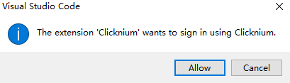

# Connect To Cloud

## Sign In
1. For users who have not signed in, click the Sign In button in the Locators panel.  
   
2. Click "Allow" in the dialog box to navigate to Clicknium official website and sign in .  
   
3. Sign in to Clicknium or sign up for a new Clicknium account.  
   
4. After signin successfully, Visual Studio Code is allowed to open with an authenticated token.  
5. When you open Visual Studio Code, select `Open` in the pop-up dialog box.  
   

## Sign Out
1. Click the user icon in the lower left corner.  
2. Hover the mouse over the Clicknium user and select `Sign Out` from the pop-up menu.  