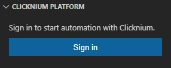
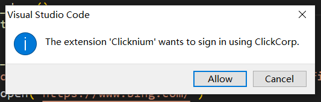
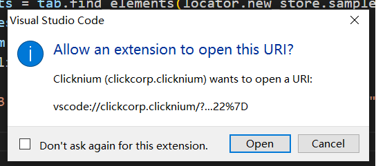

# Connect To Cloud<!-- {docsify-ignore-all} -->

  - [Sign In](#sign-in)
  - [Sign Out](#sign-out)

## Sign In
1. 未登录用户，在Locators面板中，点击Sign in按钮
   
2. 在对话框中选择Allow， 允许跳转到ClickCorp官网登录
   
3. 在ClickCorp官网登录或注册ClickCorp账号
   
4. 登录成功后，允许打开vscode 
5. 打开vscode后，在弹出的对话框中选择Open
   

## Sign Out
1. 单击左下角用户图标
2. 鼠标移动到ClickCorp用户，在弹出的二级菜单中选择Sign Out