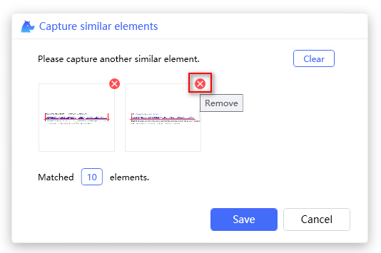
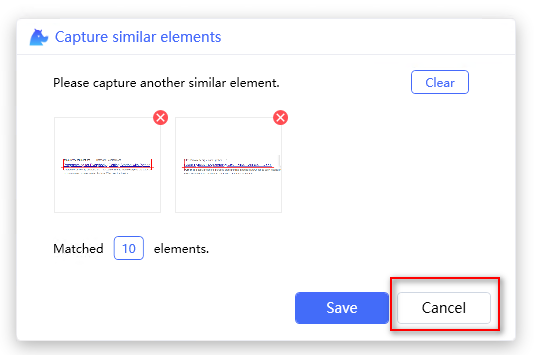

# Capture Similar Elements

"Similar elements" means UI elements with similar structure, like a list of items, or field of a list. Locators generated by this feature can be used when UI elements are processed in automation.  

- [Capture Similar Elements](#capture-similar-elements)
  - [Start recorder](#start-recorder)
  - [Capture wizard](#capture-wizard)
  - [Start capture](#start-capture)
  - [Highlight elements](#highlight-elements)
  - [Clear elements](#clear-elements)
  - [Remove element](#remove-element)
  - [Cancel capture](#cancel-capture)
  - [Recapture](#recapture)

> **Remarks:**
>- Support web UI element only by now.  
>- Xpath locator is not supported .  
>- Image locator is not supported.  

## Start recorder
Here we get three ways to start the recorder.
- Start recorder in LOCATORS tab in Visual Studio Code 

- Start recorder in CLOUD LOCATORS tab in Visual Studio Code 

- Start recorder with keyboard shortcut `Ctrl+F10` in code.   

## Capture wizard  
Click the button `Similar elements` to display a wizard window.
- Click the button `Similar elements` 

- A window of capturing similar elements wizard will be displayed as below.

## Start capturing

1. Capture the first element  
Hover the mouse onto one UI element of the target list, and  when the element is highlighted, press `Ctrl+click` to capture the locator. The image of the element will be added to the wizard window. The locator of this element will be generated accordingly and the count of the matched elements  will be displayed. 
  

2. Capture another element  
Hover the mouse onto another element of the target list and capture it by pressing  `Ctrl+click`. The image of this element will be added to the wizard window too. The locator will be updated in light of the captured elements. Check if the count of the matched elements is as expected to determine if more elements need to be captured.  
  

3. Save the locator  
Click the button `Save` to save the locator, and the locator of matched similar elements will be added to the locator store.  
  

## Highlight elements
It takes several seconds to highlight all matched elements to check if the generated locator is correct.  
- Click the matched elements count button  

- All matched elements will be highlighted as below. 

## Clear elements
Clear all the captured elements by clicking the button `Clear` on the right-top of the wizard window. It is normally used if the matched elements are not as expected and you want to start it over. Once clicking the button, the elements are removed and the button `Clear` and `Save` buttons are disabled when there is no data.  
- Click the `Clear` button  
 
- The button `Clear` and `Save` buttons are disabled when there is no data, shown as below.
这里加一个图片。
## Remove element
Remove one element in the wizard window.  
- Click the button `Remove`  
  

## Cancel capture
Discard the currently captured results and return to the main capture window.  
- Click the button `Cancel` 
  

## Recapture
Recapturing similar element can be used to update the single locator or similar locators.
1. Start by clicking the button `Recapture` in Visual Studio Code   
  
2. Click the button `Similar elements` 
  
3. Follow steps in [Start capture](#start-capture) to generate the locator. After clicking the button `Save`, the locator will be replaced by the recaptured one. 