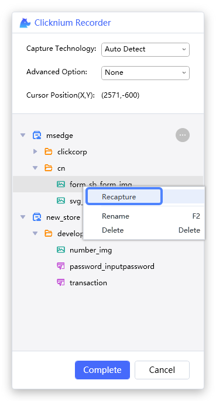
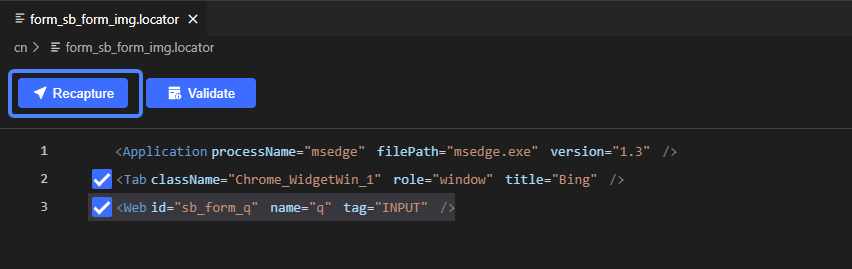
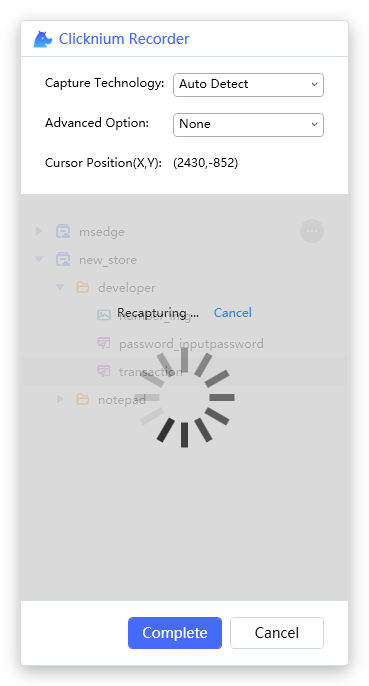
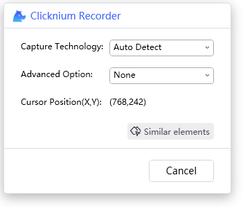
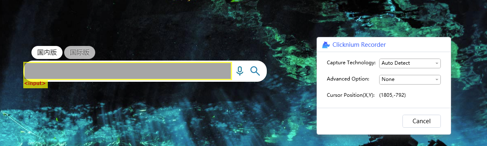

# Recapture

Recapture can be used to recoder a new UI element with selected locator name.

- [Start recapture](#start-recapture)
- [Recapture window](#recapture-window)
- [Start capture](#start-capture)

> **Remarks:**
>- Recapture only support one locator.

## Start recapture
You can recapture from both recorder and locator viewer tab in Visual Studio Code.
- Start from recorder   

- Start from Visual Studio Code   

## Recapture window  
- Start from recorder  

- Start from Visual Studio Code   

## Start capture

1. Select UI element  
When mouse moving, it will highlight the UI element, and show its position on recorder panel.

2. Press `Ctrl + click`