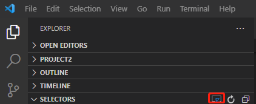
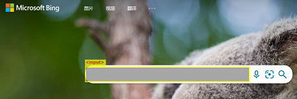
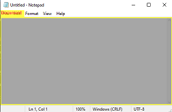

# Getting started

[Clickcorp](https://wwww.clickcorp.com) builds an open-source automation stack for developers to write software robot projects, and hosts cloud native approach products for software robot running，managment. Automation stack includes the following parts: 

[Clicknium automation SDK](api/python/pythonsdk.md): current supply python sdk, if has other language requirement, [create issue]()

[Clicknium VS Code extension](): extension for developer to create automation project, capture UI element, edit and manage ui element store, supply intelligent for writing code.  ​​


# Installation​
## System Requirement​

Clicknium requires Python 3.7 or above, work with windows 7 SP1 or above

## Steps​

- Install [Clicknium VS Ccode extension]()
- Install python SDK through [pip]()

```
# python version is 3.9 or below
pip install clicknium

# python version is 3.10 or above
pip install --pre pythonnet
pip install clicknium
```
# First web automation project
- [install browser extension](./doc/vscode.md)
- In VSCode, Open the Command Palette: `Ctrl+Shift+P`
- Input or select: clicknium:create project
- Select project path and name
  
Then project is created.
- Open browser, such as chrome, navigate to `www.bing.com`
- In VSCode, open clicknium recorder, press `Ctrl+F10` or the following button
  
- record the input box and search button
  
   
- open auto.py, write the following code
```
from clicknium import clicknium as cc, locator, ui

#open new browser window
driver = cc.chrome.open("https://www.bing.com")
driver.find_element(locator.chrome.bing.search_sb_form_q).set_text("automation")
driver.find_element(locator.chrome.bing.svg).click

#automation on already opened browser
ui(locator.chrome.bing.search_sb_form_q).set_text("automation")
ui(locator.chrome.bing.svg).click
```
- run the project
Open the Command Palette: `Ctrl+Shift+P`, Input or select: clicknium:run project

# First desktop automation project
- In VSCode, Open the Command Palette: `Ctrl+Shift+P`
- Input or select: clicknium:create project
- Select project path and name

Then project is created.
- open notepad
- In VSCode, open clicknium recorder, press `Ctrl+F10` or the following button
  
- record the input document area

  
- open auto.py, write the following code

```
from clicknium import clicknium as cc, locator, ui

ui(locator.notepad.document_15).set_text("automation")
```
- run the project
Open the Command Palette: `Ctrl+Shift+P`, Input or select: clicknium:run project