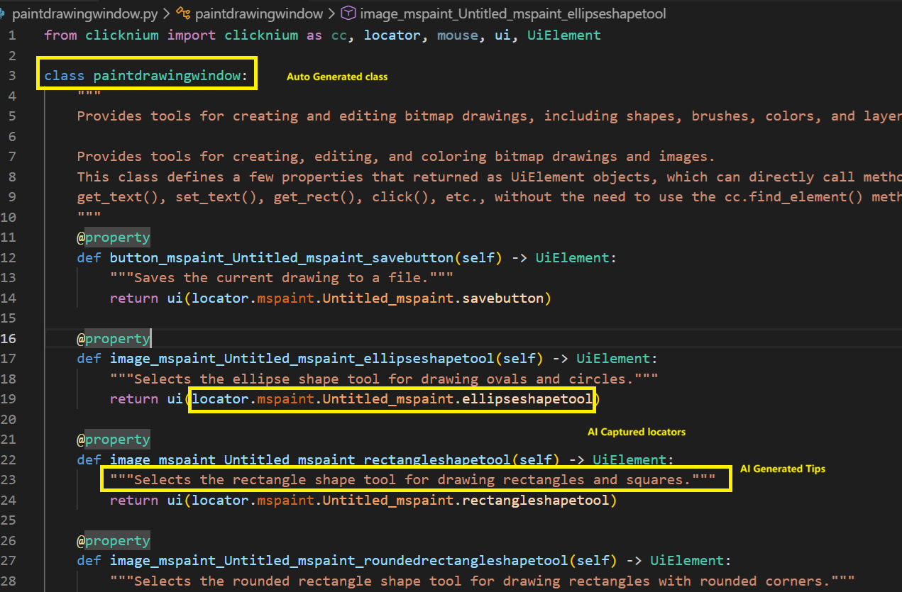
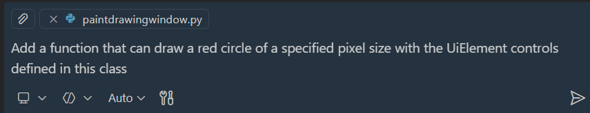
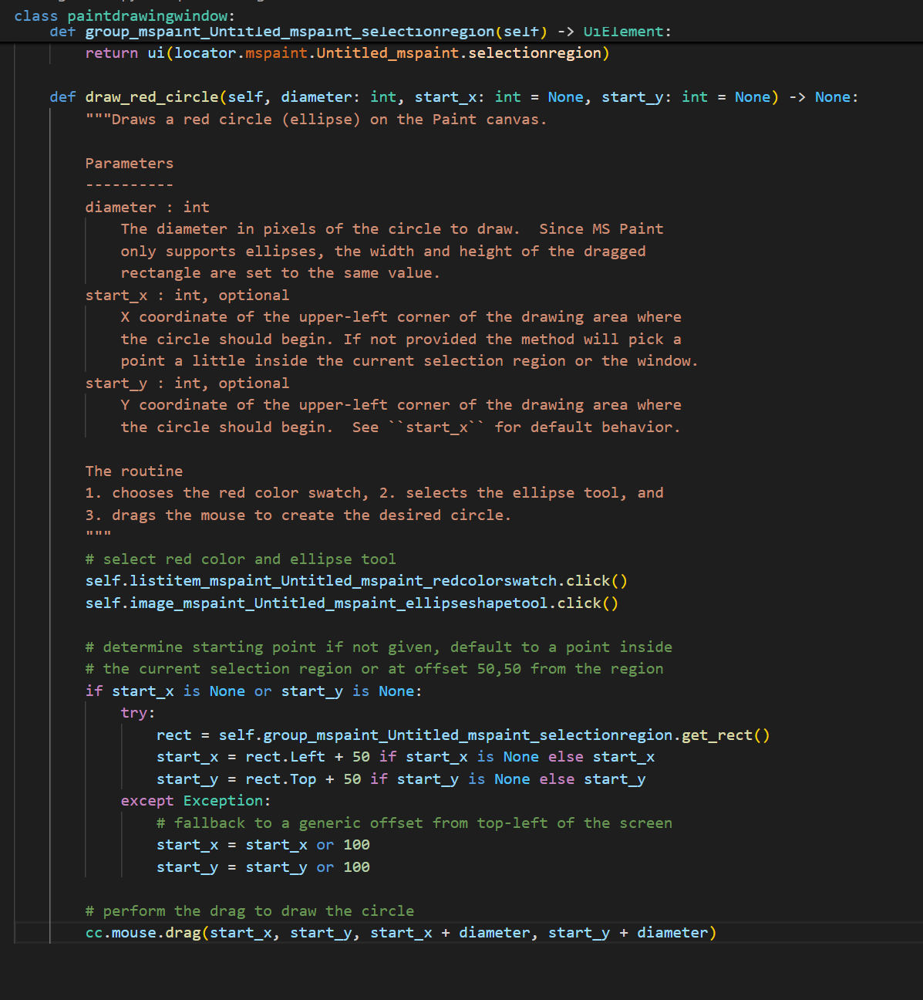
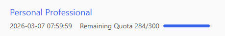
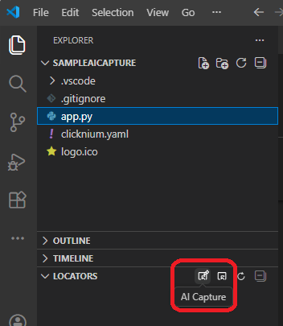
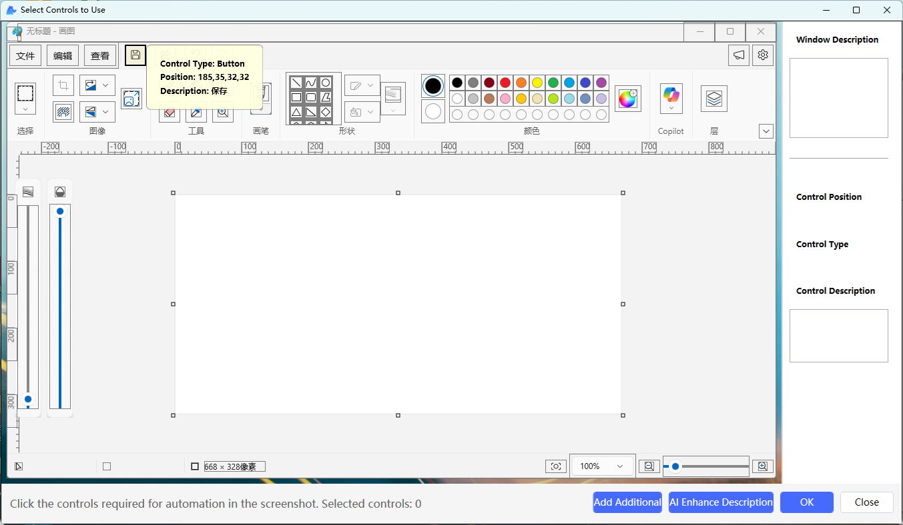
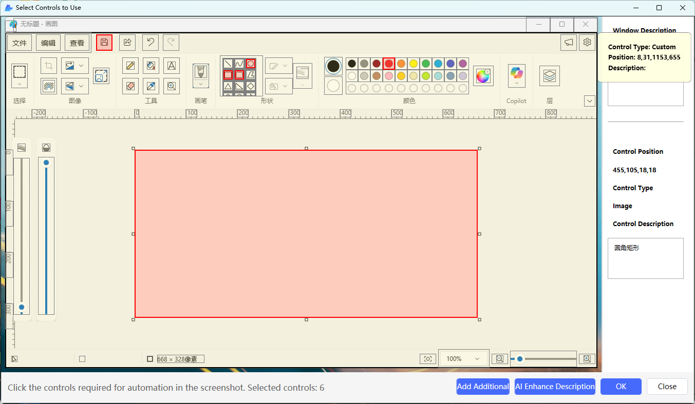
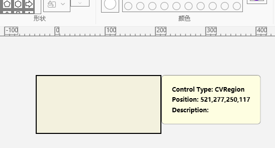
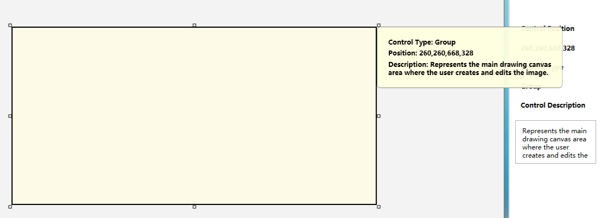
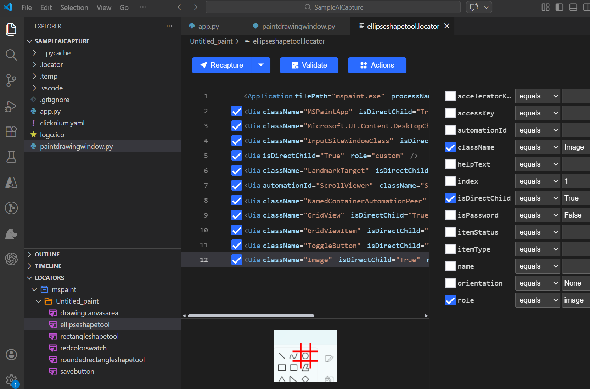

# [Clicknium-AI Capture]How to use AI Capture in clicknium
##  Introduction
We have added the AICapture feature to the Clicknium extension, which leverages large language models' understanding of the application GUI to directly generate control element classes with tips for you. Developers can use this class as a foundation to let Copilot write business code for automation operations.

below is the class auto generated by this extension filled with operatable locators and their tips：
     

with this class generated, you can easily let your agent add meaningful functions. Here is an example:
    

And below is the codes that agent written for you and it just worked like a charm:
    


- Notes:If you're interested in featurs like AICapture and futher improvements, please join us[clicknium forum @slack](http://clicknium.slack.com)

## Step by Step to use AICapture

### Dev environement preparation
1. Install the VSCode with the version that supports Agent, which will conveniently help you write code for business automation logic.
2. Install the Clicknium Extension in your VSCode from extension marketplace, version 0.1.19 or higher.
3. [Register and log in](https://sso.clicknium.com/login?callback=https://account.clicknium.com/) to your Clicknium account. Early registered accounts will receive 300 calls for large model interface understanding for free.

     

4. Create a new clicknium project following [this tutorial](https://clicknium.com/documents/tutorial/clicknium-project/#create-project)
5. Login your clicknium account from the extension

### Use AICapture
1. Find the AICapture button from Locators panel, and click:

    

2. You will enter AI Capture mode, in which you can specify the target application window. When the target application windows is masked, Hold Ctrl and left click your mouse button, the target app is AI Captured and show in the preview window as below:

    

3. In this preview window, pick the controls that you needed for your business needs (get text, click, etc. ), in this sample, we selected "Ellipse tool", "Rectangle tool", "Save button", "Red Color". But the canvas control is not identifed by default but it is needed to draw our circle, thus, we click the below "Add Additional" button to add our canvas control, after selection, it should look like below:

    

    > [!Note]
    > when you add additional control, you can "shift+left-Mouse-button" to drag a CV region selector as beow:
    > 

4. With all controls selected, click the below "AI Enhance Description" which will let the AI Model to generate appropriate tips. And of course, you can manually change the description from the right description text box. Below is the returned tips for the central canvas control:

    


5. The last step is to click "OK" to generate the locators visually and then the python windows class for you. Please be noted that it may take a few seconds for the tool to go through all the controls you selected. Below is the python codes generated for the above controls:

    ```python
    from clicknium import clicknium as cc, locator, mouse, ui, UiElement

    class paintdrawingwindow:
        """
        Provides a canvas and drawing tools to create, edit, and save bitmap images.

        Provides tools for creating, editing, and coloring bitmap drawings and images.
        This class defines a few properties that returned as UiElement objects, which can directly call methods such as 
        get_text(), set_text(), get_rect(), click(), etc., without the need to use the cc.find_element() method
        """
        @property
        def button_mspaint_Untitled_paint_savebutton(self) -> UiElement:
            """Saves the current image to a file, updating an existing file or prompting for a location if it is new."""
            return ui(locator.mspaint.Untitled_paint.savebutton)

        @property
        def image_mspaint_Untitled_paint_ellipseshapetool(self) -> UiElement:
            """Selects the ellipse shape tool so the user can draw ellipses or circles on the canvas."""
            return ui(locator.mspaint.Untitled_paint.ellipseshapetool)

        @property
        def image_mspaint_Untitled_paint_rectangleshapetool(self) -> UiElement:
            """Selects the rectangle shape tool so the user can draw rectangles or squares on the canvas."""
            return ui(locator.mspaint.Untitled_paint.rectangleshapetool)

        @property
        def image_mspaint_Untitled_paint_roundedrectangleshapetool(self) -> UiElement:
            """Selects the rounded-rectangle shape tool so the user can draw rectangles with rounded corners."""
            return ui(locator.mspaint.Untitled_paint.roundedrectangleshapetool)

        @property
        def listitem_mspaint_Untitled_paint_redcolorswatch(self) -> UiElement:
            """Applies red as the active drawing color for tools and shapes."""
            return ui(locator.mspaint.Untitled_paint.redcolorswatch)

        @property
        def group_mspaint_Untitled_paint_drawingcanvasarea(self) -> UiElement:
            """Represents the main drawing canvas area where the user creates and edits the image."""
            return ui(locator.mspaint.Untitled_paint.drawingcanvasarea)

    ```

6. And you can see the editors from the locators view just as before:

    

7. Now you can have your agent or code copilot to write codes for you. (Please check the introduction session)


## Release notes
- Currently only windows application is supported.
