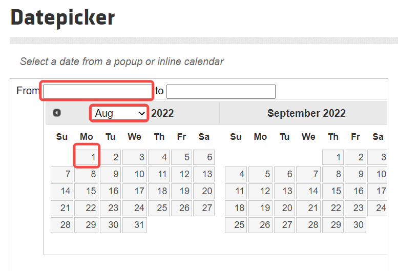
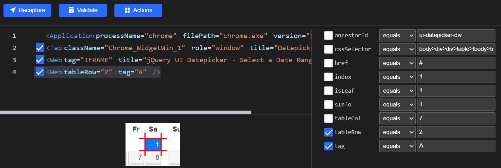
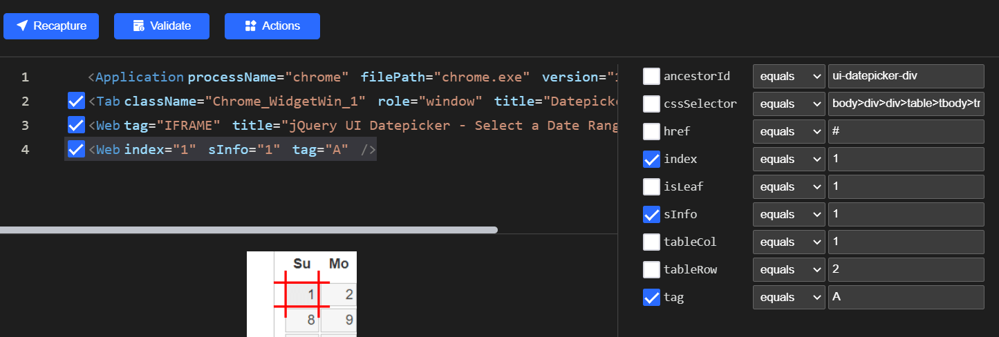
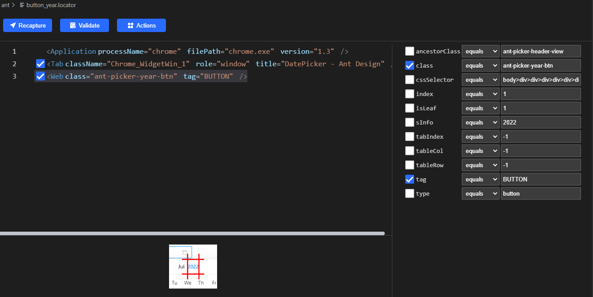
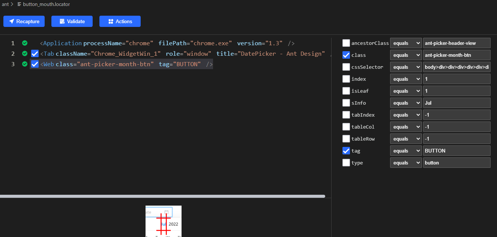
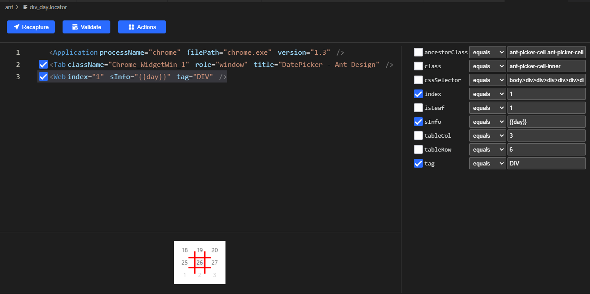

# How to Set Values for Calendar
##  Introduction
It is a common requirement to set date values at website. But there are a lot of component libraries with different frameworks. So let's take a look at how Clicknium implements date-related operations in a variety of web UI frameworks.  
:::tip Notes

More about the installation and the tutorial of Clicknium Automation, please refer to [here](https://www.clicknium.com/documents).

:::

## The Types of Calendar UI Control

### jQueryUI Calendar 
The UI repository based on jQuery. For more information, please refer to [here](https://jqueryui.com/datepicker/#date-range).

### Ant Design
The UI repository based on React. For more information, please refer to [here](https://ant.design/components/date-picker/).  
- Notes: The Web Recorder in Clicknium requires a browser extension except IE browser. More about the installation, please refer to [Clicknium browser plugin](https://www.clicknium.com/documents/tutorial/extensions/) 


## Automate calendar with Clicknium

### JqueryUI Calendar
1. With the Clicknium recorder, the component elements operated in recording the page.   
   Clicknium provides an excellent recording.  
   For more information, please refer to [Clicknium Recorder](https://www.clicknium.com/documents/tutorial/recorder/).
 
   Here is the content recorded as below.
  
   Three parts of "TO" are recorded the same way as "FROM".

2. Change the locator of the date. As automatic recording is generated according to rows and columns of the table where the date is located, the rows and columns of the dates in each month are different and cannot be accurately located.  Here we change the date element to be located by sinfo and index. 
   Before:
    
   After：
    
3. When the locator is changed, we write the code as below.
   ```python
   from clicknium import clicknium, ui, locator

   clicknium.chrome.open("https://jqueryui.com/datepicker/#date-range")

   ui(locator.chrome.jqueryui.text_from).set_focus()
   ui(locator.chrome.jqueryui.select_from).select_item("Jan")
   ui(locator.chrome.jqueryui.a_1_from).click()

   ui(locator.chrome.jqueryui.text_to).set_focus()
   ui(locator.chrome.jqueryui.select_to).select_item("Dec")
   ui(locator.chrome.jqueryui.a_31_to).click()
   ```

### Ant Design
1. Steps 
   Click the input box to pop up the date picker.  
   Compare the input values for the year. If they are not same, adjust the input values to the next year or last year .Same for the month.   
   When the year and the month are same, find and click the element of the day.
   
2. With the Clicknium recorder,the component elements operated in recording the page.  
   The recorded elements are shown as below.
    
3. Change text.locator. The index needs to be checked as there are several Examples in the page.
  
   Change the locators of the year, the month and the day. Locate the year and the month with the class attribute instead of the sInfo. Locate the day with the variable day instead of sInfo.
   After changing
    
    
    
4. Write the code as below.
   
   ```python
   from clicknium import clicknium, ui, locator

   # Input
   year = '2010'
   mouth = 'Jan'
   day = '1'

   # The month corresponding to the date control
   months = ['Jan', 'Feb', 'Mar', 'Apr', 'May', 'Jun', 'Jul', 'Aug', 'Sep', 'Oct', 'Nov', 'Dec']

   # Open the page
   clicknium.chrome.open("https://ant.design/components/date-picker/")

   # Click the date input
   ui(locator.chrome.ant.text).mouse_down()

   # Compare the year. If not same, adjust to the next year or last year by clicking the button until they are same.
   locator_year = ui(locator.chrome.ant.button_year)
   current_year = locator_year.get_property(name="sInfo")

   while year != current_year:
      if year > current_year:
         ui(locator.chrome.ant.button_year_next).click()
      else:
         ui(locator.chrome.ant.button_year_pre).click()
      current_year = locator_year.get_property(name="sInfo")

   # Compare the month. If not same, adjust to the next month or last month by clicking the button until they are same.
   locator_mouth = ui(locator.chrome.ant.button_mouth)
   current_mouth = locator_mouth.get_property(name="sInfo")
   current_mouth_index = months.index(current_mouth)
   mouth_index = months.index(mouth)

   while current_mouth_index != mouth_index:
      if mouth_index > current_mouth_index:
         ui(locator.chrome.ant.button_mouth_next).click()
      else:
         ui(locator.chrome.ant.button_mouth_pre).click()
      current_mouth = locator_mouth.get_property(name="sInfo")
      current_mouth_index = months.index(current_mouth)

   # locate the date element with the date variable and click it.
   ui(locator.chrome.ant.div_day, {"day": day }).click()
   ```
