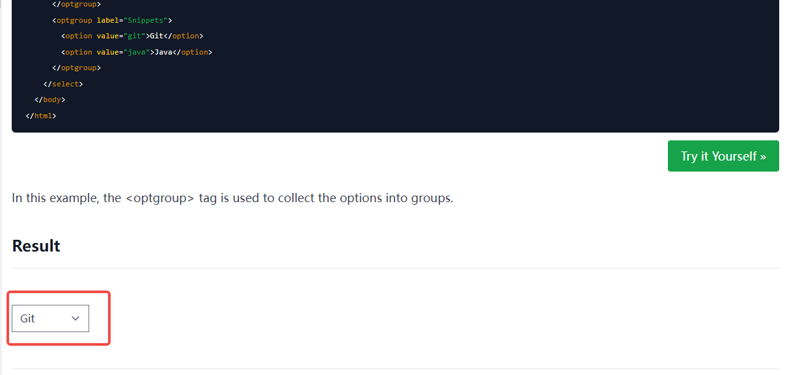
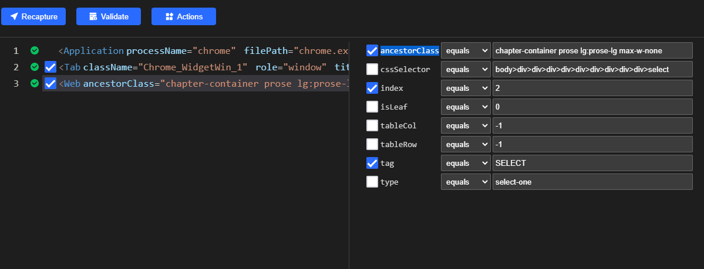
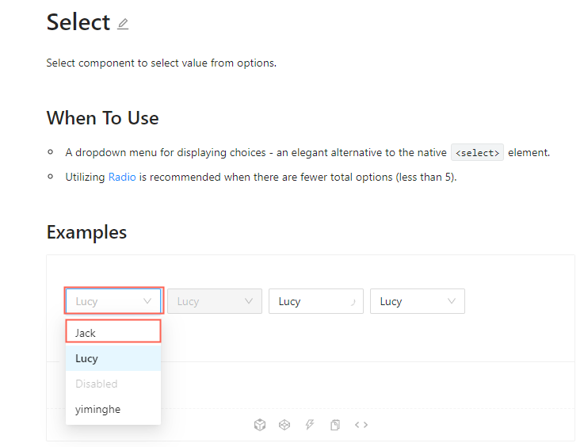
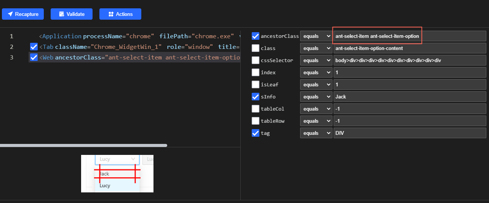

# How to Set Values for Select/Dropdown list
##  Introduction
It is a common requirement to select an item from a list on a web page. However, there are many component libraries with different frameworks. So let us look at how Clicknium implements select-related operations in various web UI frameworks.  
:::tip Notes

For more about the installation and the tutorial of Clicknium Automation, please refer to [here](https://www.clicknium.com/documents).

:::
## The Types of Select/Dropdown UI Control

### HTML Select tag 
The Select HTML tag represents a control that provides a menu of options.

### Ant Design
The UI repository based on React. For more information, please refer to [here](https://ant.design/components/select/).  
- Notes: The Web Recorder in Clicknium requires a browser extension except IE. For more about the installation, please refer to [Clicknium browser plugin](https://www.clicknium.com/documents/tutorial/extensions/) 


## Automate select/dropdown with Clicknium

### HTML Select tag
With the Clicknium recorder, you can capture an UI element easily. Clicknium provides an excellent recording experience. For more information, please refer to [Clicknium Recorder](https://www.clicknium.com/documents/tutorial/recorder/).  
 
 Sample site: https://www.w3docs.com/learn-html/html-select-tag.html

1. The following is the content that should be captured by the recorder.  
  
   

2. Go to the locator page and change the attribute of the select. Here we use ancestorClass and index to target the element. 
    
3. Use the following code to select Git option.
   ```python
   from clicknium import clicknium, ui, locator

   clicknium.chrome.open("https://www.w3docs.com/learn-html/html-select-tag.html")
   ui(locator.chrome.w3docs.select).select_item("Git")
   ```

### Ant Design
Sample site: https://ant.design/components/select/
1. Capture below elements by Clicknium Recorder.  
    
2. Change the locator attributes of the option. Uncheck className of ancestorClass.   
    

3. Use the following code to select Jack option.
   
   ```python
   from clicknium import clicknium, ui, locator

   clicknium.chrome.open("https://ant.design/components/select/")

   ui(locator.chrome.ant.select).click()
   ui(locator.chrome.ant.option_jack).click()
   ```
