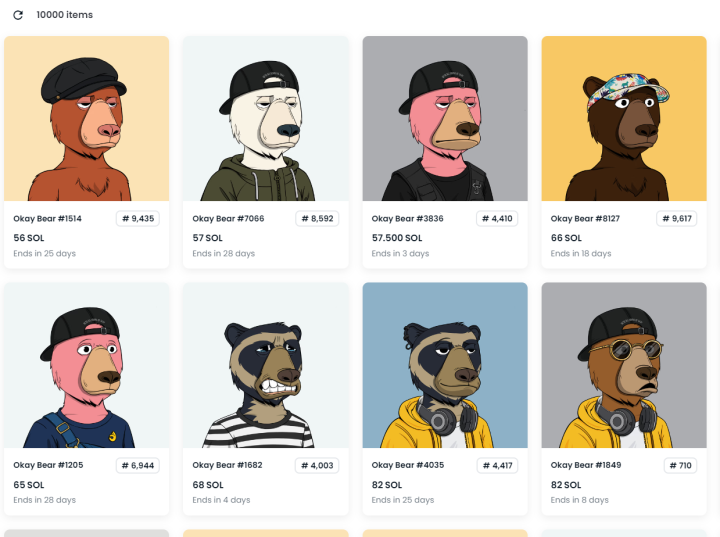
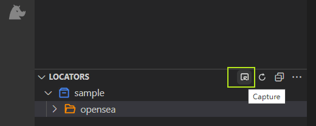
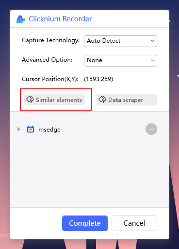
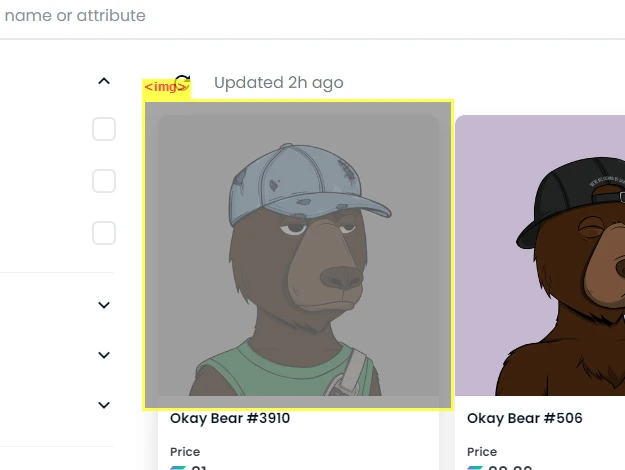
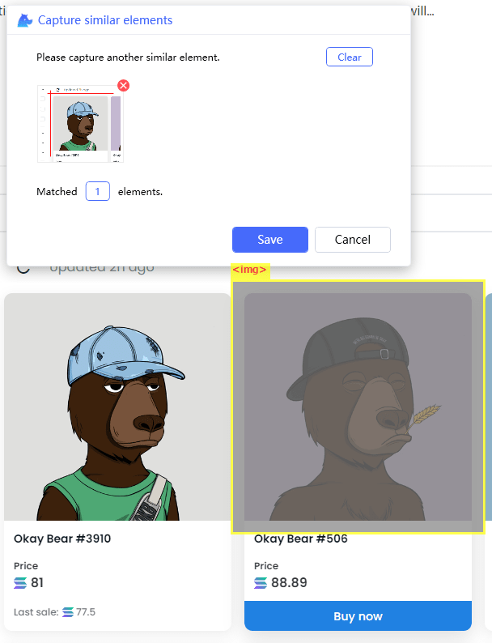

# Capture Similar Elements

Using the [Okay Bear](https://opensea.io/collection/okay-bears) image in Opensea as an example, which is a typical Grid structure.




a.  Click the Capture button in the VS Code plugin to start the Recorder: 



b. Click on Similar elements in the Recorder:




c. Ctrl + mouse click to grab the first and second elements.：




  
After crawling the locator corresponding to the similar elements, call [find_elements](https://www.clicknium.com/documents/references/python/webdriver/browser/browsertab/webelement/find_elements) to return a UI element list ([find_element](https://www.clicknium.com/documents/references/python/webdriver/browser/browsertab/webelement/find_element) returns a single UI element.


## Sample code：

Get the picture URL by [get_property](https://www.clicknium.com/documents/references/python/uielement/get_property). Download the picture using request lib, and use [send_hotkey](https://www.clicknium.com/documents/references/python/uielement/send_hotkey) to press the PgDn key to scroll and load more picture. 

```python
import requests
from time import sleep
from clicknium import clicknium as cc, locator
def main():
    cc.chrome.open("https://opensea.io/collection/okay-bears")
    nftDic = {}

    while True:
        newDic = {}
        finish = True
        sleep(4)
        nfts = cc.find_elements(locator.sample.opensea.img_okay_bear)
        for nft in nfts:
            src = nft.get_property("src")
            name = nft.get_property("alt")
            if name not in nftDic:
                newDic[name]=src
                finish = False

        for key,value in newDic.items():
            r = requests.get(value)
            print("Downloading:"+ key)
            imagePath = ".\image\" + key + ".jpg"
            with open(imagePath,'wb') as f:
                f.write(r.content)

        nftDic = nftDic | newDic
        if finish:
            break
        else:
            print("next page")
            cc.send_hotkey("{PGDN}")

if __name__ == "__main__":
    main()
```