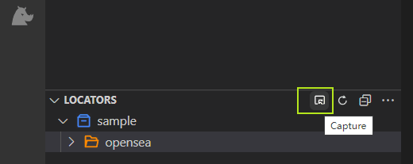

# Capture structured data

In automated scenarios, there is a great demand for obtaining structured data, especially tabular data. Capturing similar elements is only suitable for capturing one column of data. Of course, one can capture a table column by column. However, this approach may lead to alignment issues between different columns, increasing the risk of errors and making the operation cumbersome.

There are two common scenarios for structured data: 
- Tables 
- Non-tabular structured data. 

Tables are relatively easy to understand, but what is non-tabular structured data? As mentioned above, in the case of OpenSea's pages, if one needs to simultaneously capture the prices and numbers corresponding to NFT images, in order to construct a table, this can be considered non-tabular structured data. Compared with obtaining similar elements, structured data adds a matching algorithm between different columns and a range of functions to facilitate table operation.

## Capturing tabular data.

1. Start the recorder in VS Code  

2. Click data scraper in the recorder  


For example, let's capture the following table in [Coingecko](https://www.coingecko.com/).


3. Use the Ctrl+left mouse button to click on the first row and column of data in the table.
Clicknium will automatically detect the capture object for the table and prompt whether to capture the full table information.


Click **Yes** to see the data preview. On the preview page, you can modify the column name, change the column order, delete the column, and so on. You can also select No, and then select the desired data column by column.


## Capture non-tabular structured data.
Let's use an example：[Gaming chairs in Amazon website](https://www.amazon.com/s?k=gaming+chairs&pd_rd_r=071a746f-f709-4a1c-9131-c355b4cc70db&pd_rd_w=b4pJC&pd_rd_wg=gLsyP&pf_rd_p=12129333-2117-4490-9c17-6d31baf0582a&pf_rd_r=5R8Z3Y5NF2J8G0DQ66PC&ref=pd_gw_unk)

In this example, we need to fetch the product name, price, and image. The operation is similar to capturing similar elements, where two elements determine a column.

a. Capture the first cell in the first column: the first product name.

b. Capture the second cell in the first column: the second product name.

c. The first column is captured successfully, click Add column to start capturing the second column elements.

d. Capture the second column, the first element: the first product price.  

   

After capturing, Clicknium will organize the data into tables.
  
On the preview page, you can also change the column names and column order and select different attributes as column values.


### Sample Code:  
For structured data, Clicknium provides the [scrape_data](https://www.clicknium.com/documents/references/python/globalfunctions/scrape_data) method, which returns text in JSON format. Not only this function supports passing in the locator of the page flip button to achieve automatic page flip, but page flip also supports setting controls and simulating the mouse, etc., waiting for the page to load, grabbing the number of data bars control and timeout.


```python
from clicknium import clicknium as cc, locator
import pandas as pd

row = cc.scrape_data(locator.jd.phone)
df = pd.json_normalize(row)
print(df.head(10))
```