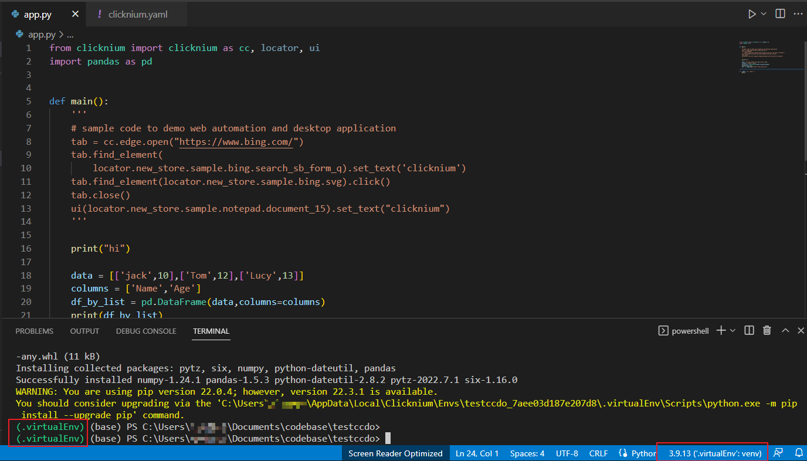

# How to Deliver Executable File/Script
##  Introduction
Clicknium automation scripts are only for Python programmers. Sometimes, it needs to be shared with different people that don't familiar with programming at all. They might not  have an environment with Python installed. It is very helpful to package the Clicknium Python script into an executable file. It is supported by Clicknium Project. 

## Create Project

In Visual Studio Code, press `Ctrl+Shift+P` to show the Command Palette, input `Clicknium: Create Project,` and then select a folder to store the project in the pop-up window. The command will also create a virtual Python environment for the project. 


When the project is created, a pop-up window in the lower right corner shows the general project initialization information, and the output panel shows details. After initialization, the current Python virtual environment can be seen when you open app.py.  


Compared to the ordinary Python project, there are a few more files:
- app.py: Python source code.
- logo.ico: Executable file's Icon.
- clicknium.yaml: Configuration file.

`app.py` is the default Python code file. You can rename or edit it.`logo. ico' is the default Icon for the exe file. It can be replaced for customize. 
`clicknium.yaml` includes some settings about the target exe file. 


## Run the project

In Visual Studio Code, press "Ctrl+Shift+P" to show the Command Palette, input or select `Clicknium: Run Project`. The Clicknium extension will deploy and run the project based on clicknium.yaml.  
 

## Debug the project

In Visual Studio Code, set a breakpoint to the code, press `Ctrl+Shift+P` to show the Command Palette, and input `Clicknium: Debug Project`.  
  

Useful Shortcut:

|  Action   | Shortcut  |
|  ----  | ----  |
| Run/Continue  | F5 |
| Pause | F6 |
| Step over  | F10 |
| Step in  | F11 |
| Step out  | Shift + F11 |
| Restart  | Ctrl+Shift+F5 |
| Stop   | Shift + F5 |  

## Project Package

**Package configuration**: Package config is in the clicknium.yaml file:  
```yaml
startUp: app
ignoreFiles: .gitignore
log:
  folder: 
  type: File
type: project
requirements:
  python: 3.9.13
  pip: 
  packages:
  - package: clicknium
    version: 
  - package: pandas
    version: 1.5.3
  locators: []
```
`app` : the Python source code file with the entry point.  
`log`: the default log path is `C:\Users\{currentUser}\AppData\Local\Clicknium\Log`. Change the folder where you want to store the log file, etc. `.\\` for the current path.  
`python`: The Python version to package into the exe file.   
`packages`: The dependencies of the script. The package name and version will be auto-included. If the auto-included process does not work, you need to manually add the Python libs into the file. 

**Build the executable file**:  
In Visual Studio Code, press `Ctrl+Shift+P` to show the Command Palette, input or select `Clicknium: Package Project`. There are two modes for the .exe file. If it's a simple command-line script, choose `console.` If the Python Project included any GUI, choose `gui`. Next, select the path to save the executable file.


The detailed package log Output displays in the Output in Visual Studio Code.

Once the package is finished, the saving folder will be opened to show the target executable file.

You can also use [Pyinstaller](https://pyinstaller.org/en/stable/) to package Python script into an executable file. 

## Run without a web browser extension
Web browser extension must be installed and enabled when developing the Clicknium web automation script. When developers deliver the script to business users, business users might not know how to install the Clicknium browser extension. The following code can check and install the extension.  
```Python
 if cc.chrome.extension.install_or_update():
    print("Please open Chrome browser to enable clicknium extension, then run again.")
```
There is another option: [Chrome DevTools Protocol(CDP)](https://chromedevtools.github.io/devtools-protocol/). Clicknium supported CDP after version 0.1.12. Switch `cc.chrome` to `cc.chromecdp` to use the CDP APIs which can run without web automation extension.

```python
# need to run with browser extension 
chrome_tab = cc.chrome.open("https://www.bing.com")


# open Chrome browser with CDP
chrome_tab = cc.chromecdp.open("https://www.bing.com")

```
