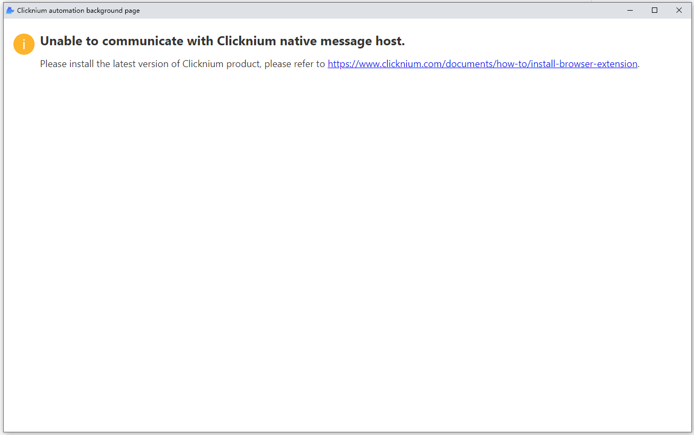
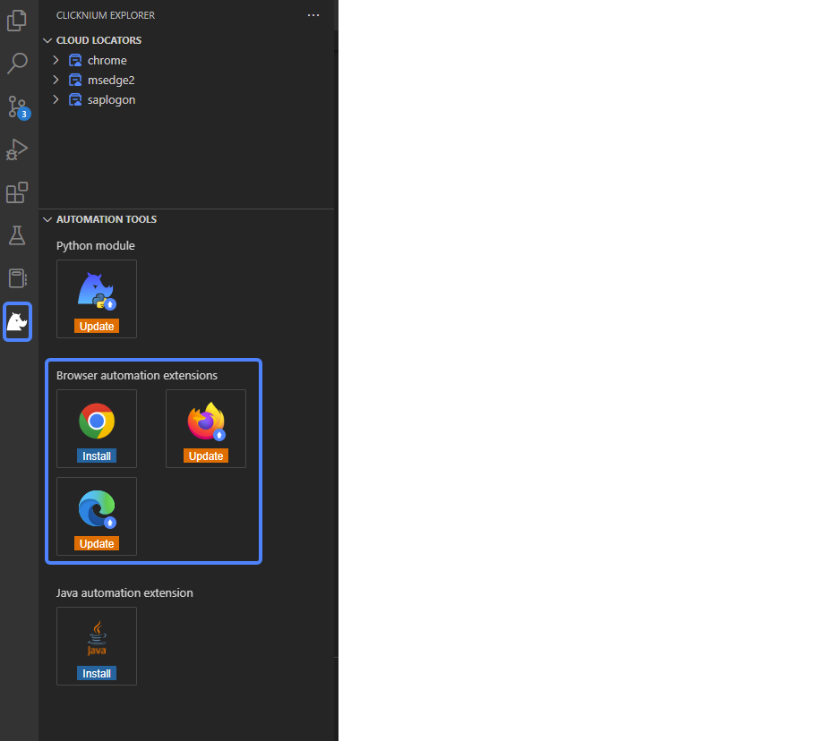

# How to Install Browser Extension

## Introduction
Since the support of manifest V2 ends in Jun, 2023 for all Chromium-based browsers. We upgrade Chrome and Edge browser extensions from manifest V2 to V3.

## Scenario
WIf you install Clicknium extension from [Chrome Web Store](https://chrome.google.com/webstore/detail/clicknium-recorder/ifnedcgcleipmmolmnhoeemmjnljjgna), and get the error "Unable to communicate with Clicknium native message host." from the popup window. There are two ways to install Clicknium native message host instead.



## Two ways to install browser extension

### Version Requirement
[Clicknium Visual Studio Code Extension](https://marketplace.visualstudio.com/items?itemName=ClickCorp.clicknium) >= 0.1.9  
[Clicknium Python Module](https://pypi.org/project/clicknium/) >= 0.1.10

### Install from Clicknium Python Command
```Python
from clicknium import clicknium as cc

# install chrome extension
cc.chrome.extension.install()

# install edge extension
cc.edge.extension.install()
```

### Install from Clicknium Visual Studio Code Extension
Find the `AUTOMATION TOOLS` tab in the `Clicknium Extension Panel` and click the `Install` button.


