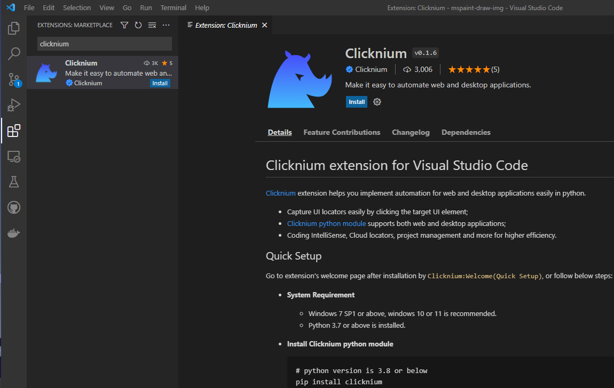
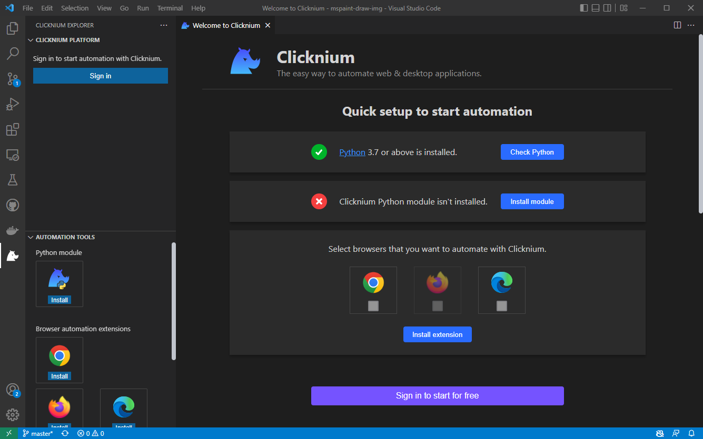

# Quick Start

## Prerequisites
### System Requirements​
|                     | Main version                 | 
|---------------------|------------------------------|
| Python              | 3.7, 3.8, 3.9, 3.10          | 
| OS                  | Windows 7 SP1 or above       |


### Code Editor
- Visual Studio Code

## Installation​
### Set up Clicknium Visual Studio Code Extension
1. Install the [Extension](https://marketplace.visualstudio.com/items?itemName=ClickCorp.clicknium) (or search `Clicknium` in Visual Studio Code Extension marketplace).  
  
2. Click `CLICKNIUM EXPLORER` in Visual Studio Code Activity Bar
3. Follow the Welcome page:
    - Check the Python environment.
    - Install Clicknium Python module, as well as `pip install clicknium`
    - Select and install the browser extensions. Enable the extension after the installation. 
    - Sign in to start for free.  
    
    

_To Reopen Wilcome Page: open the Command Palette: Ctrl+Shift+P, input `Clicknium:Welcome`_  
_To Wnable Edge Extension: Open Edge browser, type `edge://extensions/` into address bar and enable `Clicknium Recorder` extension as below:_
  

## Automation Sample

Get a sample script showing automation of web page and notepad.

### Setup Sample Project
- CLick `Clicknium: Sample` in Welcome Page. Or Input: `Clicknium: Sample` In Visual Studio Code Command Palette(`Ctrl+Shift+P`) 
- Choose a path to locate sample project

The sample.py contains two automation samples, one is Edge web automation, and the other is notepad automation.

```python
import subprocess
from time import sleep
from clicknium import clicknium as cc, locator, ui

def main():
    # sample code to demo web automation and desktop application
    tab = cc.edge.open("https://www.bing.com/")
    tab.find_element(
        locator.new_store.sample.bing.search_sb_form_q).set_text('clicknium')
    tab.find_element(locator.new_store.sample.bing.svg).click()
    sleep(3)
    tab.close()

    process = subprocess.Popen("notepad")
    ui(locator.new_store.sample.notepad.document_15).set_text("clicknium")

if __name__ == "__main__":
    main()
```

### Run the sample
In Visual Studio Code, open sample.py and press `Ctrl+F5` to run the script with following steps: 
- Open a search engine page
- Input a keyword and click search button
- Open a notepad
- Input text to notepad

## Next
Learn [how to start an automation project from zero](./tutorial/firstautomation.md).
## Document Guidelines
For more about Clicknium Visual Studio Code, please refer to [here](./tutorial/vscode/vscode.md).  
You may need to refer [Clicknium Python package documents](./references/python/python.md) when writing code.  
For more tools provided by Clicknium, please refer to:  
- [Clicknium Recorder](./tutorial/recorder/recorder.md).  
- Clicknium Browser Extension: [Chrome](./tutorial/extensions/chromeextension.md), [Edge](./tutorial/extensions/edgeextension.md), [Firefox](./tutorial/extensions/firefoxextension.md).  
- [Clicknium Java Extension](./tutorial/extensions/javaextension.md).  
