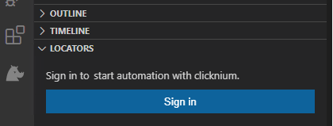
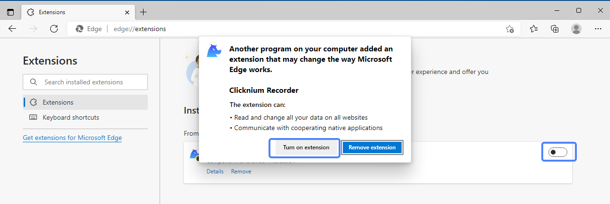

# Quick Start

## Prerequirement
### System Requirements​
- Windows 7 SP1 or above, Windows 10 or 11 is recommended
- Python 3.7 or above.

### Code Editor
- Visual Studio Code

### Clicknum Account 
- Register [Clicknium Account](https://www.clicknium.com/).

## Installation​

### Install Clicknium Python package
Use pip to install Clicknium package:  

```
# Python version is 3.8 or below
pip install clicknium

# Python version is 3.9 or above
pip install --pre pythonnet
pip install clicknium
```

### Setup Clicknium Visual Studio Code Extension
Click the link to install [Extension](https://marketplace.visualstudio.com/items?itemName=ClickCorp.clicknium) (or search Clicknium in Visual Studio Code Extension marketplace).  
Sign in your Clicknium account. 

  

## Automation Sample

Get a sample script showing automation of web page and notepad.

### Install and enable browser extension
- Click `CLICKNIUM EXPLORER` in Visual Studio Code Activity Bar.  
- Show `AUTOMATION EXTENSIONS` view in Visual Studio Code Side Bar.  
- Choose the Edge browser and click the `Install` button.  
- Open Edge browser, type `edge://extensions/` into address bar and enable `Clicknium Recorder` extension as below.  

  


### Setup sample project
- In Visual Studio Code, open the Command Palette: `Ctrl+Shift+P`
- Input or select: `Clicknium: Sample`
- Choose a path to locate sample project

The sample.py contains two automation samples, one is Edge web automation, and the other is notepad automation.

```python
import subprocess
from time import sleep
from clicknium import clicknium as cc, locator, ui

def main():
    # sample code to demo web automation and desktop application
    tab = cc.edge.open("https://www.bing.com/")
    tab.find_element(
        locator.new_store.sample.bing.search_sb_form_q).set_text('clicknium')
    tab.find_element(locator.new_store.sample.bing.svg).click()
    sleep(3)
    tab.close()

    process = subprocess.Popen("notepad")
    ui(locator.new_store.sample.notepad.document_15).set_text("clicknium")

if __name__ == "__main__":
    main()
```

### Run the sample
In Visual Studio Code, open sample.py and press `Ctrl+F5` to run the script. It will do: 
- Open a search engine page
- Input a keyword and click search button
- Open a notepad
- Input text to notepad

## Next . 
Learn [how to start an automation project from zero](./tutorial/firstautomation.md).
## Document Guidelines
For more about Clicknium Visual Studio Code, please refer [here](./concepts/vscode/vscode.md).  
You may need to refer [Clicknium Python package documents](./references/python/python.md) when writing code.  
For more tools provided by Clicknium, please refer to:  
- [Clicknium Recorder](./concepts/recorder/recorder.md).  
- Clicknium Browser Extension: [Chrome](./concepts/extensions/chromeextension.md), [Edge](./concepts/extensions/edgeextension.md), [Firefox](./concepts/extensions/firefoxextension.md).  
- [Clicknium Java Extension](./concepts/extensions/javaextension.md).  
