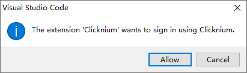

# Quick start

## Prerequirement
### System Requirements​
- Windows 7 SP1 or above, Windows 10 or 11 is recommended
- Python 3.7 or above.

### Code Editor
- Visual Studio Code

### Clicknum Account 
- Register your [Clicknium Account](https://www.clicknium.com/).

## Installation​

### Install Clicknium Python package
Use pip to install Clicknium package:  

```
# Python version is 3.8 or below
pip install clicknium

# Python version is 3.9 or above
pip install --pre pythonnet
pip install clicknium
```

### Setup Clicknium Visual Studio Code extension
Click the link to install [Extension](https://marketplace.visualstudio.com/items?itemName=ClickCorp.clicknium) (or search Clicknium in Visual Studio Code Extension marketplace).  
Sign in your Clicknium account. 

  


## Automation Sample

Get a sample script showing automation of web page and notepad.

### Install and enable browser extension
- Click `CLICKNIUM EXPLORER` in Visual Studio Code Activity Bar.  
- Show `AUTOMATION EXTENSIONS` view in Visual Studio Code Side Bar.  
- Choose the Edge browser and click the `Install` button.  
- Open Edge browser, type `edge://extensions/` into address bar and enable `Clicknium Recorder` extension as below.  

  


### Setup sample project
- In Visual Studio Code, open the Command Palette: `Ctrl+Shift+P`
- Input or select: `Clicknium: Sample`
- Choose a path to locate sample project

The sample.py contains two automation samples, one is Edge web automation, and the other is notepad automation.

```python
import subprocess
from time import sleep
from clicknium import clicknium as cc, locator, ui

def main():
    # sample code to demo web automation and desktop application
    tab = cc.edge.open("https://www.bing.com/")
    tab.find_element(
        locator.new_store.sample.bing.search_sb_form_q).set_text('clicknium')
    tab.find_element(locator.new_store.sample.bing.svg).click()
    sleep(3)
    tab.close()

    process = subprocess.Popen("notepad")
    ui(locator.new_store.sample.notepad.document_15).set_text("clicknium")

if __name__ == "__main__":
    main()
```


### Run the sample
In Visual Studio Code, open sample.py and press `Ctrl+F5` to run the script. It will do: 
- Open a search engine page
- Input a keyword and click search button
- Open a notepad
- Input text to notepad

## Capture first UI locator
There are two ways to capture UI locators: 
- By clicking `Capture` button in "LOCATORS" tab of "Explorer" side bar.  
&emsp;   
&emsp;
- By pressing `Ctrl+F10`.  
  
Once you see the Clicknium Recorder as below showing at the right side of screen, the Visual Studio Code will be minimized automatically.
- Hover mouse over the target UI element, the element will be highlighted with a rectangle.
- Press `Ctrl+Click` to capture locator for the target element, the locator will be added to the locator store listing in the tree area of Clicknium Recorder.  
- Click `Complete` button to return to Visual Studio Code. 


- For more about Clicknium Recorder, refer [here](./developtools/vscode/recorder/recorder.md).  

## First line automation code
After capturing UI locators, write Python script to automate the target UI element as below. 
- For any locator you captured, you can reference it in code by starting `locator.`, the following node will be listed in syntax popup for you to select and autofill.
```python
from clicknium import clicknium as cc, locator, ui
cc.find_element(locator.new_store.sample.targetele).click()
ui(locator.new_store.sample.targetele).click()
```
- For more about automation API, refer [Clicknium Python package documents](./references/python/python.md).   

## Run/Debug automation code
- Open related Python file, run this script by `Ctrl+F5`.
- Open related Python file, debug this script by `F5`.


## About Clicknium Project
With Clicknium project, you can develop an automation solution in an isolated Python virtual environment. The isolated environment guarantees the project behave indifferently in different developers' working environments. 
Clicknium provides following commands about project, you may view more [here](./developtools/vscode/project_management.md).  
- `Clicknium: Create Project` create a project.
- `Clicknium: Debug Project` debug the project.
- `Clicknium: Run Project` run the project.
- `Clicknium: Package Project` package the project to a standalone executable file.


## Document Guidelines
For more about Clicknium Visual Studio Code, please refer [here](./developtools/vscode/vscode.md).  
You may need to refer [Clicknium Python package documents](./references/python/python.md) when writing code.  
For more tools provided by Clicknium, please refer to:  
- [Clicknium Recorder](./developtools/vscode/recorder/recorder.md).  
- Clicknium Browser Extension: [Chrome](./developtools/vscode/extensions/chromeextension.md), [Edge](./developtools/vscode/extensions/edgeextension.md), [Firefox](./developtools/vscode/extensions/firefoxextension.md).  
- [Clicknium Java Extension](./developtools/vscode/extensions/javaextension.md).  
