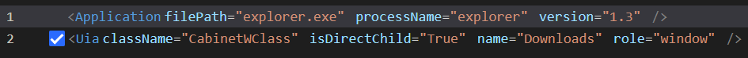

# maximize

```python
def maximize(
        self, 
        locator: Union[_Locator, str],
        locator_variables: dict = {}, 
        timeout: int = 30
    ) -> None
```  

Maximize the window specified by locator.   
***Notes***: The locator should be recorded using [UIA](../../../concepts/uia.md) technology, role is window, for example:  
        

**Parameters:**  
    &emsp;**locator[Required]**: str | _Locator   
        &emsp;&emsp; Locator string, the visit path of locator for target window element, eg: 'locator.explorer.window_downloads', locator store is explorer, and locator name is window_downloads. For more details, please refer to [Locator](./../../../concepts/locator.md).  

    &emsp;**locator_variables**: dict  
        &emsp;&emsp; Locator variables, set to initialize parameters in locator, eg: `{ "row": 1,  "column": 1}`, more about variables, please refer to [Parametric Locator](./../../../concepts/locator.md#parametric-locator).  
    &emsp;**timeout**: int  
        &emsp;&emsp; Timeout for the operation, the unit is second, and the default value is 30 seconds. 

**Returns:**  
    &emsp;None

**Example:**
***
```python
from clicknium import clicknium as cc

# get window driver
window_driver = cc.window

# maximize window
window_driver.maximize("locator.notepad.window_notitle_notepad")

# parametric locator
variables = {"name":"test"}
window_driver.maximize("locator.notepad.window_notitle_notepad", variables)
```