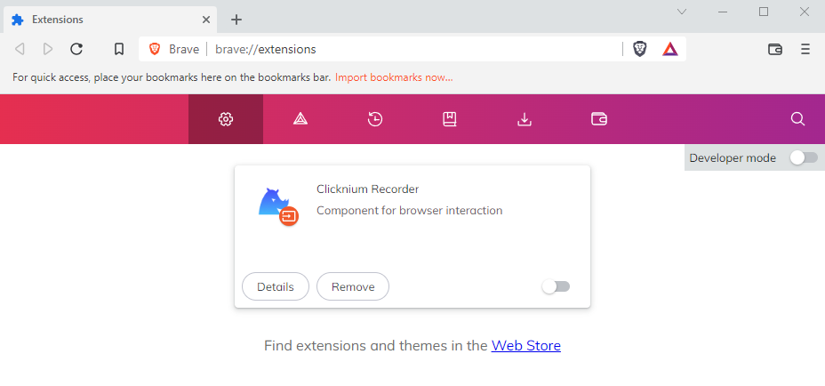
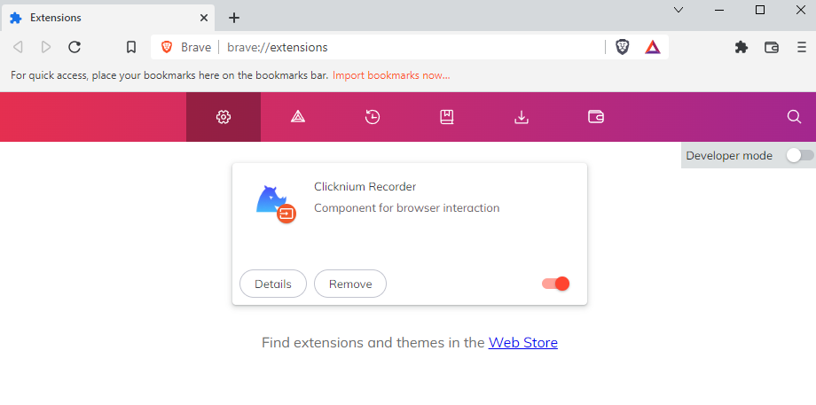
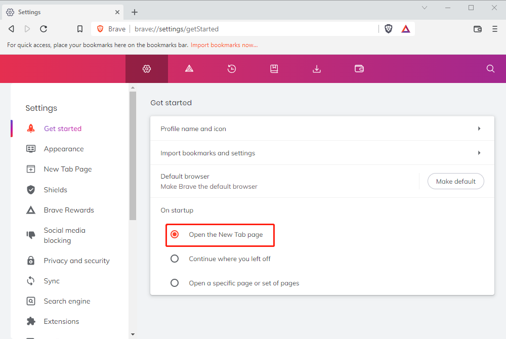

# Brave Extension

**You can automate Brave by installing the Brave extension.**

> **Remarks:**
>
>- Please close Brave & Chrome browsers before installing the extension.

## Installation

1. You can install the extension in the following way:  
    - Install the Brave extension via [Clicknium Python command](./../../references/python/webdriver/webextension/webextension.md)  

    ```python
    from clicknium import clicknium as cc

    # install chrome extension
    cc.chromium('brave').extension.install_or_update()
    ```
    - Follow the wizard to turn on the extension  
    

    - Open Brave browser and click "Extensions" in the side navigation bar  
       
    - Click the button "Enable" in the lower right corner of this extension.  
    

2. You can refer to console output for more installation details.


## Use Brave in Clicknium 
```python
from clicknium import clicknium as cc
# open Brave browser
brave_tab = cc.chromium('brave').open("https://www.bing.com", timeout = 10)
```

## Notes
You can do the following setting to avoid opening mulitple tabs when open brave browser.  
&emsp;&emsp;


