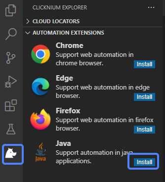
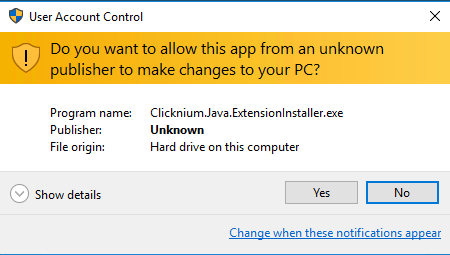

# Java Extension

**Java Extension is applicable to the automation of Java 1.6 or higher applications.**

> **Remarks:**
>
> For applications opened with Java 9+ JRE:
>- Prior to Java 9, JRE included the attach module, which Java Extension relies on to automate Java applications.
>- For Java 9+, the attach module is only included in JDK. For applications opened with JRE9+, you need to manually add this module under JRE directory.
>- Before installing the extension, please close all Java applications.

## Install

1. You can install the extension in two ways:

    - Install the extension in [VSCode Clicknium Extension](./../../tutorial/vscode/vscode.md)  
        

    - Install the extension via [Clicknium Python command](./../../references/python/java/java.md)
    ```python
    from clicknium import clicknium as cc

    # install java extension
    cc.java.extension.install()
    ```

2. Click "Yes" on the User Account Control window to start the installation.  
   &emsp;&emsp;


3. You can refer to console output for more installation details.
