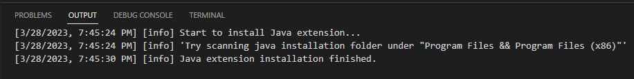
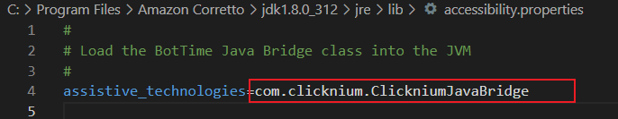

# JAVA Extension

JAVA Extension applies to the automation of **Java 1.6 and greater but below Java 14** applications. The support for JAVA 17 and the whole experience for JAVA automation is in progress.


## Installation

1. Install the extension in two ways:

    - Install the extension in [VSCode Clicknium Extension](./../../tutorial/vscode/vscode.md)  
          

    - Install the extension via [Clicknium Python command](./../../references/python/java/java.md)
    ```python
    from clicknium import clicknium as cc

    # Install JAVA extension
    cc.java.extension.install()
    ```

2. Click "Yes" on the User Account Control window to start the installation.  
   &emsp;&emsp;


3. Refer to the console output for more installation details. Please note that the JAVA extension status will `not change` in VS Code extension since multiple JRE/JDK environments could exist.   


### Double-check the installation status:  
 Go to `{JRE}/lib/accessibility.properties,` and check the file contents to see if the Clicknium settings exist.   
 


## Configration steps for JAVA 9+ environment
> **Remarks:**
> For applications opened with JAVA 9, 11, and 14, there are a few more steps to set the bridge manually:
>- 1. Go to the Python site-package folder to find the JAVA bridge dependencies, such as `C:\Program Files\Python\Lib\site-packages\clicknium\.lib\automation\JavaSupport`
>- 2. Copy `accessibility.properties` to current user folder(such as `C:\Users\Administrator` ) and rename to `.accessibility.properties`
>- 3. Add Java bridge dependencies in the step 1 folder to CLASSPATH or run with -cp in the command line. For example, there is [demo Swing App from Oracle](https://www.oracle.com/java/technologies/java-archive-misc-downloads.html#jdk8demos). FilechooserDemo is under the path 'demo\jfc\FileChooserDemo\'. 
>- 4. Run with the command: `java  -cp 'D:\swingset2-1.0-SNAPSHOT.jar;C:\Program Files\Python\Lib\site-packages\clicknium\.lib\automation\JavaSupport\*' swingset.SwingSet2` 
>- Before installing the extension, please close all JAVA applications. Restart VS Code after the installation the first time. 
