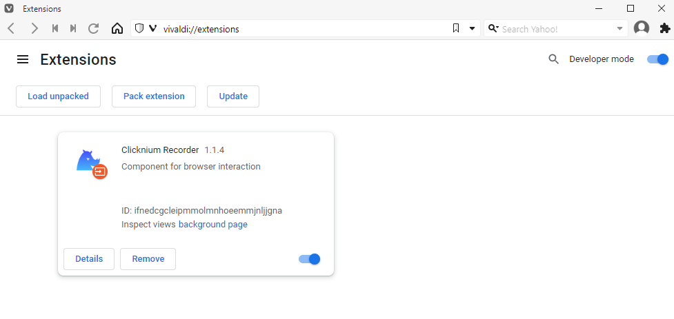
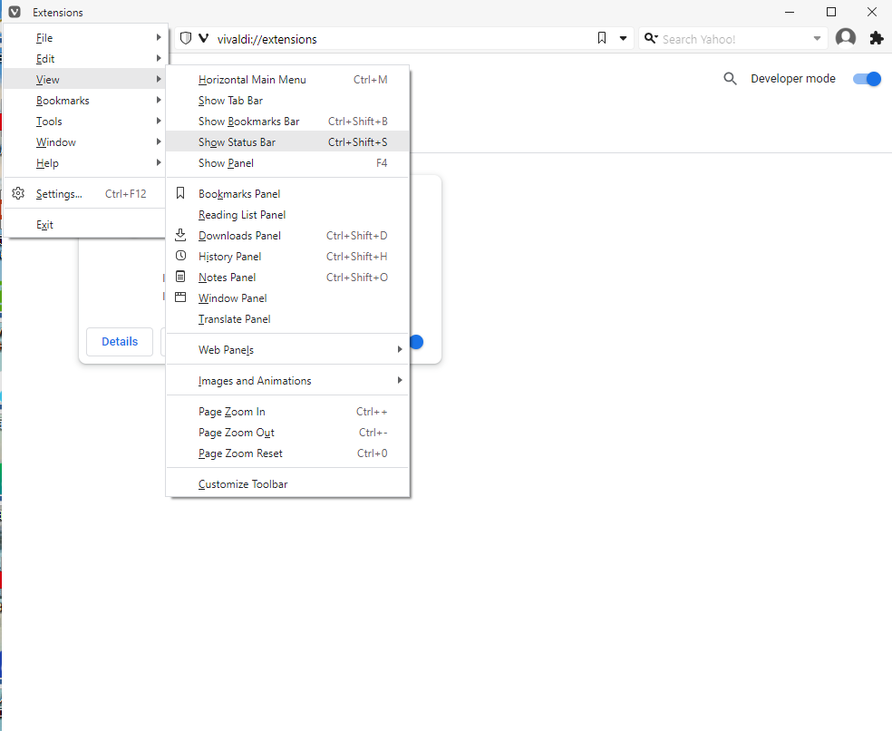
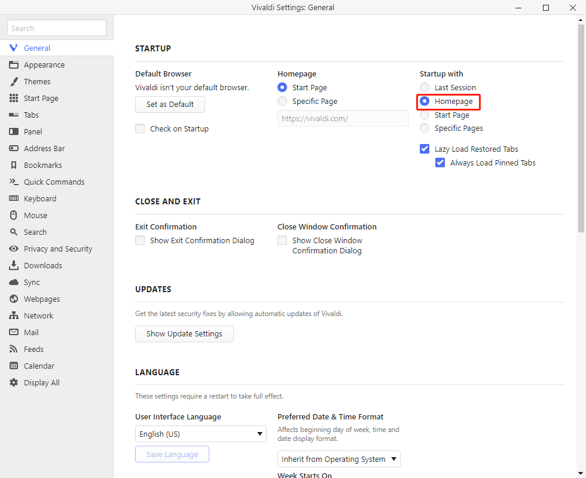

# Vivaldi Extension

**You can automate Vivaldi by installing the Vivaldi extension.**

> **Remarks:**
>
>- Please close Vivaldi & Chrome browsers before installing the extension.

## Install

1. You can install the extension in the following way:  
    - Install the Vivaldi extension via [Clicknium Python command](./../../references/python/webdriver/webextension/webextension.md)

    ```python
    from clicknium import clicknium as cc

    # install chrome extension
    cc.chromium('vivaldi').extension.install_or_update()
    ```
    - Follow the wizard to turn on the extension
    

    - Open Vivaldi browser and click "Tools->Extensions" in the left side navigation bar  
    &emsp;&emsp;   
    - Click the button "Enable" in the lower right corner of this extension.  
    &emsp;&emsp;

2. You can refer to console output for more installation details.
3. Hidden the status bar, this is ***important***, as it has impact during recording.
&emsp;&emsp;

## Notes
You can do the following setting to avoid opening mulitple tabs when open Vivaldi browser.
&emsp;&emsp;

