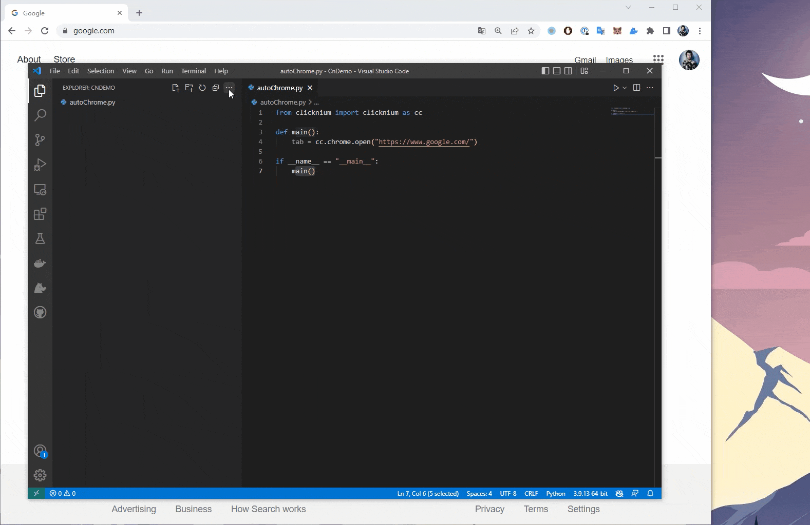
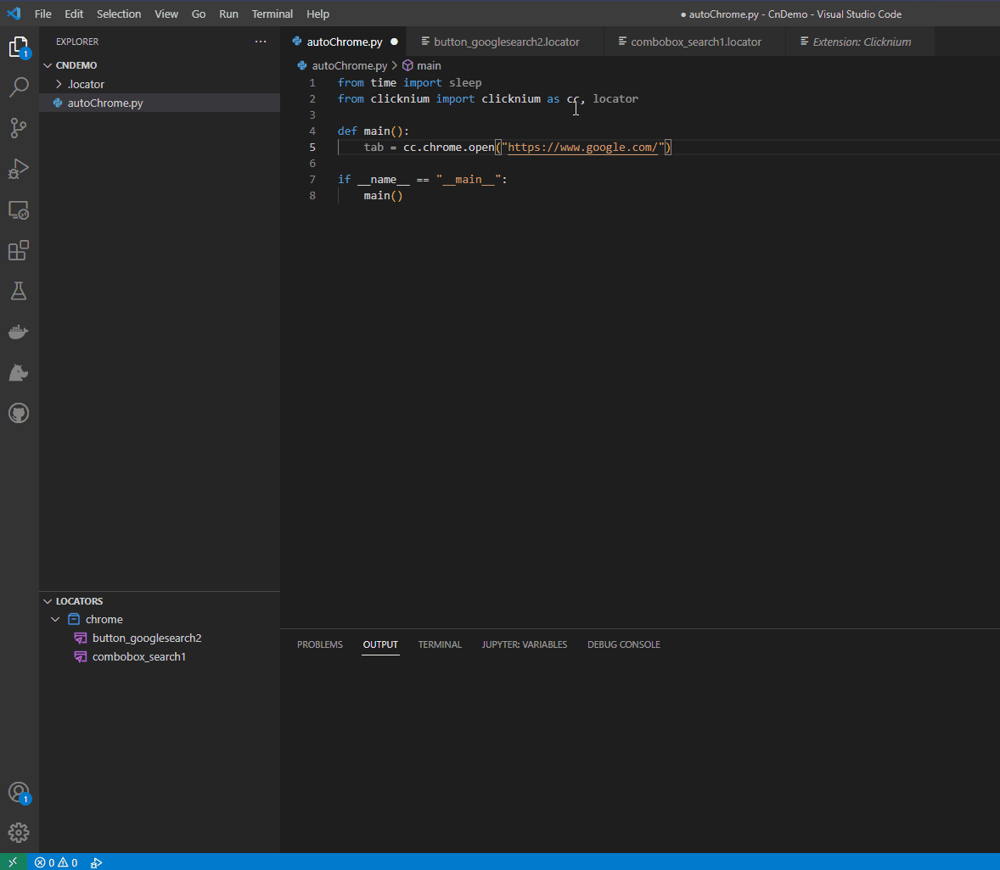

# First Automation Project 
In this tutorial, we will work through a simple Clicknium automation script from zero to help you get familliar with Clicknium. This script will open a Chrome browser and google 'Clicknium'.

## Installation
Please follow [Quick Start](./../quickstart.md#installation​) first to install Clicknium and related extensions. 

## Create a Python file
Following code will open a Chrome browser and get into Google website. (*Make sure [Clicknium Chrome Extension](./../concepts/extensions/chromeextension.md) is ready.*) 
```python
from clicknium import clicknium as cc, locator

def main():
    tab = cc.chrome.open("https://www.google.com/")

if __name__ == "__main__":
    main()
```

## Capture first UI locator
In the next step, we need to use [Locators](./../concepts/locator.md) to identity the UI element that we want to operate. [Clicknium Recorder](./../concepts/recorder/recorder.md) will help to catpure locators. 

- Click `Capture` button in `LOCATORS` tab of `Explorer` side bar or pressing `Ctrl+F10 for shortcut in VS Code.    
- [Clicknium Recorder](./../concepts/recorder/recorder.md) will pop up.  
- Hover mouse over the Google Search bar, it will be highlighted with a rectangle.
- Press `Ctrl+Click` to capture locator for the target element, the locator will be added to the [Locator Store](./../concepts/locatorstore.md) listing in the tree area of Clicknium Recorder.  
- Capture `search` botton with the same approach. 
- Click `Complete` button.   
  

## First line automation code
After capturing UI locators, use Clicknium automation API and locators to input text into search bar and click search button. 
- reference locators in code by starting `locator.` , the following node will be listed in syntax popup for you to select and autofill.
```python
tab.find_element(locator.chrome.combobox_search1).set_text("Clicknium")
tab.find_element(locator.chrome.button_googlesearch2).click()
```
You can add a line of `sleep(3)` to avoid VS Code shutting down the browser too quickly. 
For more about automation API, refer [Clicknium Python package documents](./../references/python/python.md).  


## Run/Debug automation code
- Open related Python file, run this script by `Ctrl+F5`.
- Open related Python file, debug this script by `F5`.


