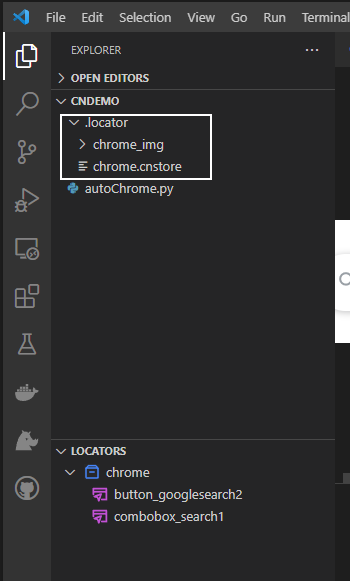

# Locator Store
Locator Store is where Clicknium stores locators. 

## Overview
Clicknium provides locator store to help developers manage locators. Locators will be sent into locator store automatically after captured by Clicknium Recorder. You can edit and manage locators in the store. Python code intelliSense will auto update in real-time. There are two types of locator store: **Local Locator Store** and **Cloud Locator Store**. Clicknium supports switching in both types.  

# Locator Store Type
There are two types of locator store:
- Local locator Store
- Cloud locator Store

## Local Locator Store
Local locator Store will automatically generated by default when the recorder captured first locator. Local locator store is a file in the project root path that stores the locators. According to the implementation, the store will go with the Python project and cannot be share with another project. It also means that the code can run offline. 

## Cloud Locator Store 
Cloud Locator Store is powered by Clicknium. After a successful log-in, cloud locator store will be connected. It can be referenced into the current project. The frequently-used locators are stored in the cloud locator store so they can be shared among different projects by even different person. The Python scripts can run anywhere with the Internet access.   

## How to choose

<table>
  <tr>
    <td> <b>Type</b> </td>
    <td> <b>Pros</b> </td>
    <td> <b>Cons</b> </td>
  </tr>
  <tr>
    <td> Cloud Locator Store</td>
    <td> - Recorded once and used anywhere across projects/computers.    - If UI changes break the locator, fixing one locator is enough for all projects. </td>
    <td> - Need Internet access.</td>
  </tr>
    <tr>
    <td> Local Locator Store</td>
    <td> - Offline run.  </td>
    <td> - Need to record each locator for every project.   - Can't be shared cross projects/computers.</td>
  </tr> 
</table>

# Locator Store Management
You can manage the Locator Store in Clicknium Recorder, your projects and Clicknium VS Code panel for the Cloud Store with the same experience. When you modify the locator store, please refresh the locater store in other place to sync the latest version.  
 
Supported Store Operations:
- Create new store
- Rename store name: please notice it might break existing code. The store name is one part of identity of locator. The referenced code needs to be updated accordingly.
- Folder: create/update/delete a new folder under the a store to group locator.   
- Remove Reference：remove the referenced store in the project.  
- Convert to Cloud/Local locator store: locator store can be convert to local or cloud seamlessly.

You can create multiple stores. Folders can be create under a store to manage locator better. 

  

# Local Locator Management
Find Local locator store in VS Code Explorer under `LOCATOR` tab with the same experience as in cloud locator store.
## Edit Store

  

# Manage Cloud Locator Store
## Enter into 'Cloud Locators' panel
Click 'Clicknium Explorer' button in Visual Studio Code Activity Bar to show 'CLOUD LOCATORS' panel.  
If you haven't signed in yet, click 'Sign in' button to navigate to Clicknium webpage to sign up or sign in.
For more information, please refer to [Connect to Cloud](./vscode/connecttocloud.md).  
You can see the cloud locator store lists.  

## Capture locators  
Click 'Capture' button on the right side of one cloud locator store to invoke 'Clicknium Recorder', then you can capture and manage the locators in the locator store.  

  
For more information, please refer to [Clicknium Recorder](./recorder/recorder.md)  

## Reference cloud locator store to project
Click `Reference` button on the right side of one cloud locator store.  

  
The locator store will be referenced to the current project. 

  